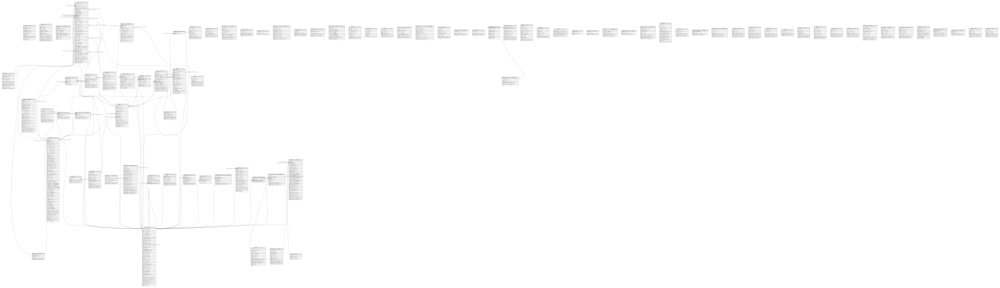

# raif_partners

## Tables

| Name | Columns | Comment | Type |
| ---- | ------- | ------- | ---- |
| [public.activity_log](public.activity_log.md) | 12 |  | BASE TABLE |
| [public.adv_view](public.adv_view.md) | 14 |  | BASE TABLE |
| [public.advertiser_notifications](public.advertiser_notifications.md) | 11 |  | BASE TABLE |
| [public.aggregate_clicks](public.aggregate_clicks.md) | 6 |  | BASE TABLE |
| [public.api_log](public.api_log.md) | 10 |  | BASE TABLE |
| [public.api_tokens](public.api_tokens.md) | 7 |  | BASE TABLE |
| [public.areas](public.areas.md) | 9 |  | BASE TABLE |
| [public.areas_types](public.areas_types.md) | 7 |  | BASE TABLE |
| [public.banned_fraud_uploads](public.banned_fraud_uploads.md) | 11 |  | BASE TABLE |
| [public.banned_frauds](public.banned_frauds.md) | 13 |  | BASE TABLE |
| [public.banned_links](public.banned_links.md) | 11 |  | BASE TABLE |
| [public.broken_links](public.broken_links.md) | 12 |  | BASE TABLE |
| [public.business_units](public.business_units.md) | 6 |  | BASE TABLE |
| [public.categories](public.categories.md) | 5 |  | BASE TABLE |
| [public.changes_log](public.changes_log.md) | 8 |  | BASE TABLE |
| [public.clicks](public.clicks.md) | 9 |  | BASE TABLE |
| [public.clicks_broken](public.clicks_broken.md) | 3 |  | BASE TABLE |
| [public.clicks_to_link_with_utm_marks](public.clicks_to_link_with_utm_marks.md) | 11 |  | BASE TABLE |
| [public.comments](public.comments.md) | 5 |  | BASE TABLE |
| [public.documentation_offers](public.documentation_offers.md) | 6 |  | BASE TABLE |
| [public.economic_efficiency_charts](public.economic_efficiency_charts.md) | 11 |  | BASE TABLE |
| [public.email](public.email.md) | 10 |  | BASE TABLE |
| [public.enter_log](public.enter_log.md) | 6 |  | BASE TABLE |
| [public.failed_jobs](public.failed_jobs.md) | 7 |  | BASE TABLE |
| [public.files](public.files.md) | 7 |  | BASE TABLE |
| [public.for_registration_users](public.for_registration_users.md) | 9 |  | BASE TABLE |
| [public.health_check_result_history_items](public.health_check_result_history_items.md) | 11 |  | BASE TABLE |
| [public.history_update_user_profiles](public.history_update_user_profiles.md) | 8 |  | BASE TABLE |
| [public.ip_agreement](public.ip_agreement.md) | 9 |  | BASE TABLE |
| [public.ip_agreement_status](public.ip_agreement_status.md) | 4 |  | BASE TABLE |
| [public.ip_blacklist](public.ip_blacklist.md) | 4 |  | BASE TABLE |
| [public.job_batches](public.job_batches.md) | 10 |  | BASE TABLE |
| [public.knowledge_base](public.knowledge_base.md) | 12 |  | BASE TABLE |
| [public.knowledge_base_categories](public.knowledge_base_categories.md) | 6 |  | BASE TABLE |
| [public.landings](public.landings.md) | 14 |  | BASE TABLE |
| [public.links](public.links.md) | 19 |  | BASE TABLE |
| [public.links_checker](public.links_checker.md) | 13 |  | BASE TABLE |
| [public.mail_logger](public.mail_logger.md) | 8 |  | BASE TABLE |
| [public.meta](public.meta.md) | 6 |  | BASE TABLE |
| [public.migrations](public.migrations.md) | 3 |  | BASE TABLE |
| [public.news](public.news.md) | 15 |  | BASE TABLE |
| [public.news_users](public.news_users.md) | 4 |  | BASE TABLE |
| [public.notify](public.notify.md) | 21 |  | BASE TABLE |
| [public.notify_params](public.notify_params.md) | 20 |  | BASE TABLE |
| [public.ofertas](public.ofertas.md) | 5 |  | BASE TABLE |
| [public.offer_categories](public.offer_categories.md) | 5 |  | BASE TABLE |
| [public.offer_materials](public.offer_materials.md) | 28 |  | BASE TABLE |
| [public.offer_rules](public.offer_rules.md) | 11 |  | BASE TABLE |
| [public.offers](public.offers.md) | 72 |  | BASE TABLE |
| [public.offers_meta](public.offers_meta.md) | 5 |  | BASE TABLE |
| [public.offers_partners_approves](public.offers_partners_approves.md) | 5 |  | BASE TABLE |
| [public.orders](public.orders.md) | 52 |  | BASE TABLE |
| [public.orders_broken](public.orders_broken.md) | 3 |  | BASE TABLE |
| [public.orders_status_mapping](public.orders_status_mapping.md) | 6 |  | BASE TABLE |
| [public.partner_payments](public.partner_payments.md) | 15 |  | BASE TABLE |
| [public.partner_turnovers](public.partner_turnovers.md) | 7 |  | BASE TABLE |
| [public.password_reset_tokens](public.password_reset_tokens.md) | 3 |  | BASE TABLE |
| [public.pay_methods](public.pay_methods.md) | 4 |  | BASE TABLE |
| [public.personal_access_tokens](public.personal_access_tokens.md) | 10 |  | BASE TABLE |
| [public.pixel_log](public.pixel_log.md) | 16 |  | BASE TABLE |
| [public.products](public.products.md) | 6 |  | BASE TABLE |
| [public.rate_rule_tag](public.rate_rule_tag.md) | 2 |  | BASE TABLE |
| [public.rate_rules](public.rate_rules.md) | 17 |  | BASE TABLE |
| [public.reestrs](public.reestrs.md) | 15 |  | BASE TABLE |
| [public.servicedesk_task_comments](public.servicedesk_task_comments.md) | 9 |  | BASE TABLE |
| [public.servicedesk_task_readers](public.servicedesk_task_readers.md) | 4 |  | BASE TABLE |
| [public.servicedesk_task_templates](public.servicedesk_task_templates.md) | 7 |  | BASE TABLE |
| [public.servicedesk_tasks](public.servicedesk_tasks.md) | 13 |  | BASE TABLE |
| [public.tag_partner](public.tag_partner.md) | 7 |  | BASE TABLE |
| [public.tags](public.tags.md) | 8 |  | BASE TABLE |
| [public.title_allowance](public.title_allowance.md) | 9 |  | BASE TABLE |
| [public.title_card](public.title_card.md) | 7 |  | BASE TABLE |
| [public.titles](public.titles.md) | 5 |  | BASE TABLE |
| [public.titles_archive](public.titles_archive.md) | 8 |  | BASE TABLE |
| [public.titles_rule](public.titles_rule.md) | 10 |  | BASE TABLE |
| [public.titles_text](public.titles_text.md) | 7 |  | BASE TABLE |
| [public.traffic_sources](public.traffic_sources.md) | 7 |  | BASE TABLE |
| [public.trigger_email_blocks](public.trigger_email_blocks.md) | 12 |  | BASE TABLE |
| [public.trigger_formal_mails](public.trigger_formal_mails.md) | 9 |  | BASE TABLE |
| [public.trigger_informal_mails](public.trigger_informal_mails.md) | 9 |  | BASE TABLE |
| [public.trigger_news](public.trigger_news.md) | 10 |  | BASE TABLE |
| [public.trigger_news_users](public.trigger_news_users.md) | 6 |  | BASE TABLE |
| [public.user_profile_readers](public.user_profile_readers.md) | 4 |  | BASE TABLE |
| [public.user_titles](public.user_titles.md) | 7 |  | BASE TABLE |
| [public.user_types](public.user_types.md) | 7 |  | BASE TABLE |
| [public.users](public.users.md) | 50 |  | BASE TABLE |
| [public.users_pay_methods](public.users_pay_methods.md) | 34 |  | BASE TABLE |
| [public.users_personal_data](public.users_personal_data.md) | 24 |  | BASE TABLE |

## Relations

---

> Generated by [tbls](https://github.com/k1LoW/tbls)
