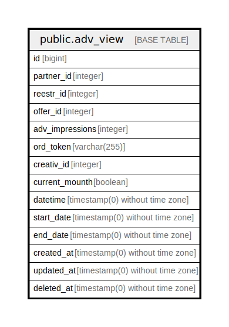

# public.adv_view

## Description

## Columns

| Name | Type | Default | Nullable | Children | Parents | Comment |
| ---- | ---- | ------- | -------- | -------- | ------- | ------- |
| id | bigint | nextval('adv_view_id_seq'::regclass) | false |  |  |  |
| partner_id | integer |  | false |  |  |  |
| reestr_id | integer |  | false |  |  |  |
| offer_id | integer |  | false |  |  |  |
| adv_impressions | integer |  | true |  |  | количество показов |
| ord_token | varchar(255) |  | false |  |  | токен креатива |
| creativ_id | integer |  | false |  |  | идентификатор баннера |
| current_mounth | boolean | true | true |  |  |  |
| datetime | timestamp(0) without time zone |  | true |  |  | дата реестра |
| start_date | timestamp(0) without time zone |  | true |  |  |  |
| end_date | timestamp(0) without time zone |  | true |  |  |  |
| created_at | timestamp(0) without time zone |  | true |  |  |  |
| updated_at | timestamp(0) without time zone |  | true |  |  |  |
| deleted_at | timestamp(0) without time zone |  | true |  |  |  |

## Constraints

| Name | Type | Definition |
| ---- | ---- | ---------- |
| adv_view_pkey | PRIMARY KEY | PRIMARY KEY (id) |

## Indexes

| Name | Definition |
| ---- | ---------- |
| adv_view_pkey | CREATE UNIQUE INDEX adv_view_pkey ON public.adv_view USING btree (id) |

## Relations

---

> Generated by [tbls](https://github.com/k1LoW/tbls)
