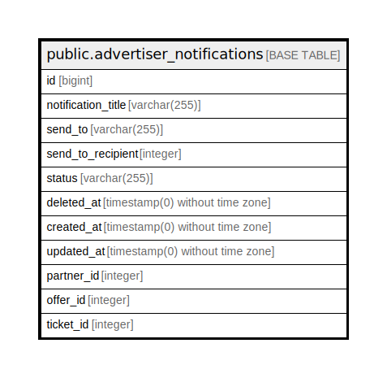

# public.advertiser_notifications

## Description

## Columns

| Name | Type | Default | Nullable | Children | Parents | Comment |
| ---- | ---- | ------- | -------- | -------- | ------- | ------- |
| id | bigint | nextval('advertiser_notifications_id_seq'::regclass) | false |  |  |  |
| notification_title | varchar(255) |  | true |  |  |  |
| send_to | varchar(255) |  | true |  |  |  |
| send_to_recipient | integer |  | true |  |  |  |
| status | varchar(255) |  | true |  |  |  |
| deleted_at | timestamp(0) without time zone |  | true |  |  |  |
| created_at | timestamp(0) without time zone |  | true |  |  |  |
| updated_at | timestamp(0) without time zone |  | true |  |  |  |
| partner_id | integer |  | true |  |  |  |
| offer_id | integer |  | true |  |  |  |
| ticket_id | integer |  | true |  |  |  |

## Constraints

| Name | Type | Definition |
| ---- | ---- | ---------- |
| advertiser_notifications_pkey | PRIMARY KEY | PRIMARY KEY (id) |

## Indexes

| Name | Definition |
| ---- | ---------- |
| advertiser_notifications_pkey | CREATE UNIQUE INDEX advertiser_notifications_pkey ON public.advertiser_notifications USING btree (id) |

## Relations

---

> Generated by [tbls](https://github.com/k1LoW/tbls)
