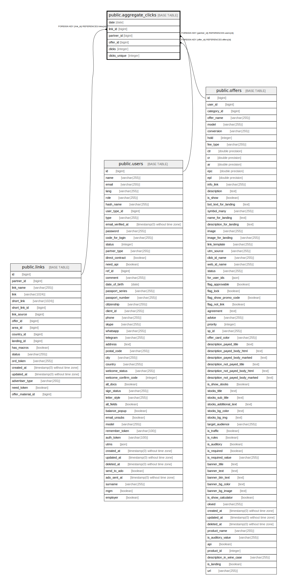

# public.aggregate_clicks

## Description

## Columns

| Name | Type | Default | Nullable | Children | Parents | Comment |
| ---- | ---- | ------- | -------- | -------- | ------- | ------- |
| date | date |  | false |  |  |  |
| link_id | bigint |  | false |  | [public.links](public.links.md) |  |
| partner_id | bigint |  | false |  | [public.users](public.users.md) |  |
| offer_id | bigint |  | false |  | [public.offers](public.offers.md) |  |
| clicks | integer | 0 | false |  |  |  |
| clicks_unique | integer | 0 | false |  |  |  |

## Constraints

| Name | Type | Definition |
| ---- | ---- | ---------- |
| aggregate_clicks_pkey | PRIMARY KEY | PRIMARY KEY (date, link_id, offer_id, partner_id) |
| aggregate_clicks_link_id_foreign | FOREIGN KEY | FOREIGN KEY (link_id) REFERENCES links(id) |
| aggregate_clicks_offer_id_foreign | FOREIGN KEY | FOREIGN KEY (offer_id) REFERENCES offers(id) |
| aggregate_clicks_partner_id_foreign | FOREIGN KEY | FOREIGN KEY (partner_id) REFERENCES users(id) |

## Indexes

| Name | Definition |
| ---- | ---------- |
| aggregate_clicks_pkey | CREATE UNIQUE INDEX aggregate_clicks_pkey ON public.aggregate_clicks USING btree (date, link_id, offer_id, partner_id) |

## Relations

---

> Generated by [tbls](https://github.com/k1LoW/tbls)
