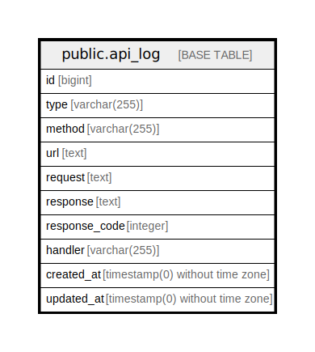

# public.api_log

## Description

## Columns

| Name | Type | Default | Nullable | Children | Parents | Comment |
| ---- | ---- | ------- | -------- | -------- | ------- | ------- |
| id | bigint | nextval('api_log_id_seq'::regclass) | false |  |  |  |
| type | varchar(255) |  | true |  |  | Тип - входящий/исходящий |
| method | varchar(255) |  | true |  |  | Метод запроса |
| url | text |  | true |  |  | URL запроса |
| request | text |  | true |  |  | Запрос |
| response | text |  | true |  |  | Ответ |
| response_code | integer |  | true |  |  | Код ответа |
| handler | varchar(255) |  | true |  |  | Обработчик запроса |
| created_at | timestamp(0) without time zone |  | true |  |  |  |
| updated_at | timestamp(0) without time zone |  | true |  |  |  |

## Constraints

| Name | Type | Definition |
| ---- | ---- | ---------- |
| api_log_pkey | PRIMARY KEY | PRIMARY KEY (id) |

## Indexes

| Name | Definition |
| ---- | ---------- |
| api_log_pkey | CREATE UNIQUE INDEX api_log_pkey ON public.api_log USING btree (id) |

## Relations

---

> Generated by [tbls](https://github.com/k1LoW/tbls)
