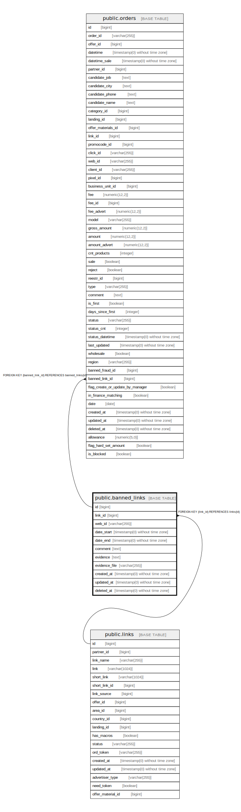

# public.banned_links

## Description

## Columns

| Name | Type | Default | Nullable | Children | Parents | Comment |
| ---- | ---- | ------- | -------- | -------- | ------- | ------- |
| id | bigint | nextval('banned_links_id_seq'::regclass) | false | [public.orders](public.orders.md) |  |  |
| link_id | bigint |  | true |  | [public.links](public.links.md) |  |
| web_id | varchar(255) |  | true |  |  |  |
| date_start | timestamp(0) without time zone |  | false |  |  |  |
| date_end | timestamp(0) without time zone |  | true |  |  |  |
| comment | text |  | true |  |  |  |
| evidence | text |  | true |  |  |  |
| evidence_file | varchar(255) |  | true |  |  |  |
| created_at | timestamp(0) without time zone |  | true |  |  |  |
| updated_at | timestamp(0) without time zone |  | true |  |  |  |
| deleted_at | timestamp(0) without time zone |  | true |  |  |  |

## Constraints

| Name | Type | Definition |
| ---- | ---- | ---------- |
| banned_links_pkey | PRIMARY KEY | PRIMARY KEY (id) |
| pk | FOREIGN KEY | FOREIGN KEY (link_id) REFERENCES links(id) |

## Indexes

| Name | Definition |
| ---- | ---------- |
| banned_links_pkey | CREATE UNIQUE INDEX banned_links_pkey ON public.banned_links USING btree (id) |
| banned_links_web_id_index | CREATE INDEX banned_links_web_id_index ON public.banned_links USING btree (web_id) |

## Relations

---

> Generated by [tbls](https://github.com/k1LoW/tbls)
