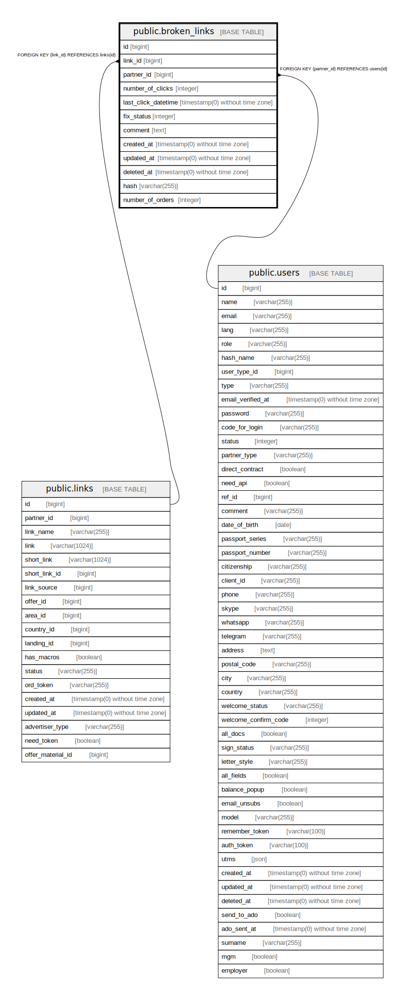

# public.broken_links

## Description

## Columns

| Name | Type | Default | Nullable | Children | Parents | Comment |
| ---- | ---- | ------- | -------- | -------- | ------- | ------- |
| id | bigint | nextval('broken_links_id_seq'::regclass) | false |  |  |  |
| link_id | bigint |  | false |  | [public.links](public.links.md) |  |
| partner_id | bigint |  | true |  | [public.users](public.users.md) |  |
| number_of_clicks | integer | 0 | false |  |  |  |
| last_click_datetime | timestamp(0) without time zone |  | true |  |  |  |
| fix_status | integer | 0 | false |  |  |  |
| comment | text |  | true |  |  |  |
| created_at | timestamp(0) without time zone |  | true |  |  |  |
| updated_at | timestamp(0) without time zone |  | true |  |  |  |
| deleted_at | timestamp(0) without time zone |  | true |  |  |  |
| hash | varchar(255) |  | true |  |  |  |
| number_of_orders | integer | 0 | false |  |  |  |

## Constraints

| Name | Type | Definition |
| ---- | ---- | ---------- |
| broken_links_pkey | PRIMARY KEY | PRIMARY KEY (id) |
| broken_links_link_id_foreign | FOREIGN KEY | FOREIGN KEY (link_id) REFERENCES links(id) |
| broken_links_partner_id_foreign | FOREIGN KEY | FOREIGN KEY (partner_id) REFERENCES users(id) |

## Indexes

| Name | Definition |
| ---- | ---------- |
| broken_links_pkey | CREATE UNIQUE INDEX broken_links_pkey ON public.broken_links USING btree (id) |

## Relations

---

> Generated by [tbls](https://github.com/k1LoW/tbls)
