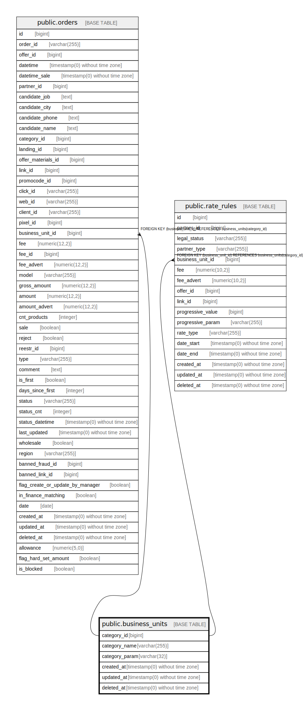

# public.business_units

## Description

## Columns

| Name | Type | Default | Nullable | Children | Parents | Comment |
| ---- | ---- | ------- | -------- | -------- | ------- | ------- |
| category_id | bigint | nextval('business_units_category_id_seq'::regclass) | false | [public.orders](public.orders.md) [public.rate_rules](public.rate_rules.md) |  |  |
| category_name | varchar(255) |  | true |  |  |  |
| category_param | varchar(32) |  | true |  |  |  |
| created_at | timestamp(0) without time zone |  | true |  |  |  |
| updated_at | timestamp(0) without time zone |  | true |  |  |  |
| deleted_at | timestamp(0) without time zone |  | true |  |  |  |

## Constraints

| Name | Type | Definition |
| ---- | ---- | ---------- |
| business_units_pkey | PRIMARY KEY | PRIMARY KEY (category_id) |

## Indexes

| Name | Definition |
| ---- | ---------- |
| business_units_pkey | CREATE UNIQUE INDEX business_units_pkey ON public.business_units USING btree (category_id) |

## Relations

---

> Generated by [tbls](https://github.com/k1LoW/tbls)
