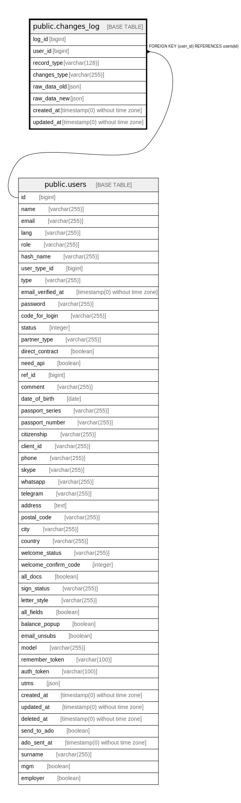

# public.changes_log

## Description

## Columns

| Name | Type | Default | Nullable | Children | Parents | Comment |
| ---- | ---- | ------- | -------- | -------- | ------- | ------- |
| log_id | bigint | nextval('changes_log_log_id_seq'::regclass) | false |  |  |  |
| user_id | bigint |  | false |  | [public.users](public.users.md) |  |
| record_type | varchar(128) |  | false |  |  |  |
| changes_type | varchar(255) |  | false |  |  |  |
| raw_data_old | json |  | false |  |  |  |
| raw_data_new | json |  | false |  |  |  |
| created_at | timestamp(0) without time zone |  | true |  |  |  |
| updated_at | timestamp(0) without time zone |  | true |  |  |  |

## Constraints

| Name | Type | Definition |
| ---- | ---- | ---------- |
| changes_log_pkey | PRIMARY KEY | PRIMARY KEY (log_id) |
| changes_log_user_id_foreign | FOREIGN KEY | FOREIGN KEY (user_id) REFERENCES users(id) |

## Indexes

| Name | Definition |
| ---- | ---------- |
| changes_log_pkey | CREATE UNIQUE INDEX changes_log_pkey ON public.changes_log USING btree (log_id) |

## Relations

---

> Generated by [tbls](https://github.com/k1LoW/tbls)
