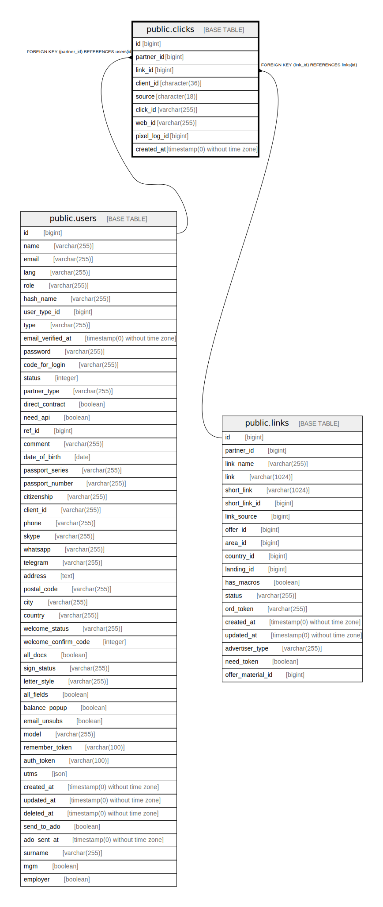

# public.clicks

## Description

## Columns

| Name | Type | Default | Nullable | Children | Parents | Comment |
| ---- | ---- | ------- | -------- | -------- | ------- | ------- |
| id | bigint | nextval('clicks_id_seq'::regclass) | false |  |  |  |
| partner_id | bigint |  | false |  | [public.users](public.users.md) |  |
| link_id | bigint |  | false |  | [public.links](public.links.md) |  |
| client_id | character(36) |  | true |  |  |  |
| source | character(18) |  | true |  |  |  |
| click_id | varchar(255) |  | true |  |  |  |
| web_id | varchar(255) |  | true |  |  |  |
| pixel_log_id | bigint |  | true |  |  |  |
| created_at | timestamp(0) without time zone |  | true |  |  |  |

## Constraints

| Name | Type | Definition |
| ---- | ---- | ---------- |
| clicks_pkey | PRIMARY KEY | PRIMARY KEY (id) |
| clicks_link_id_foreign | FOREIGN KEY | FOREIGN KEY (link_id) REFERENCES links(id) |
| clicks_partner_id_foreign | FOREIGN KEY | FOREIGN KEY (partner_id) REFERENCES users(id) |

## Indexes

| Name | Definition |
| ---- | ---------- |
| clicks_pkey | CREATE UNIQUE INDEX clicks_pkey ON public.clicks USING btree (id) |
| clicks_client_id_index | CREATE INDEX clicks_client_id_index ON public.clicks USING btree (client_id) |

## Relations

---

> Generated by [tbls](https://github.com/k1LoW/tbls)
