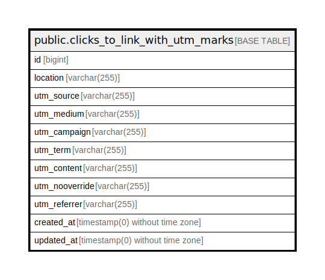

# public.clicks_to_link_with_utm_marks

## Description

## Columns

| Name | Type | Default | Nullable | Children | Parents | Comment |
| ---- | ---- | ------- | -------- | -------- | ------- | ------- |
| id | bigint | nextval('clicks_to_link_with_utm_marks_id_seq'::regclass) | false |  |  |  |
| location | varchar(255) | 'root'::character varying | false |  |  | root- главный лендинг, job - кончается на job, staff - ссылка кончается на staff |
| utm_source | varchar(255) |  | true |  |  |  |
| utm_medium | varchar(255) |  | true |  |  |  |
| utm_campaign | varchar(255) |  | true |  |  |  |
| utm_term | varchar(255) |  | true |  |  |  |
| utm_content | varchar(255) |  | true |  |  |  |
| utm_nooverride | varchar(255) |  | true |  |  |  |
| utm_referrer | varchar(255) |  | true |  |  |  |
| created_at | timestamp(0) without time zone |  | true |  |  |  |
| updated_at | timestamp(0) without time zone |  | true |  |  |  |

## Constraints

| Name | Type | Definition |
| ---- | ---- | ---------- |
| clicks_to_link_with_utm_marks_pkey | PRIMARY KEY | PRIMARY KEY (id) |

## Indexes

| Name | Definition |
| ---- | ---------- |
| clicks_to_link_with_utm_marks_pkey | CREATE UNIQUE INDEX clicks_to_link_with_utm_marks_pkey ON public.clicks_to_link_with_utm_marks USING btree (id) |

## Relations

---

> Generated by [tbls](https://github.com/k1LoW/tbls)
