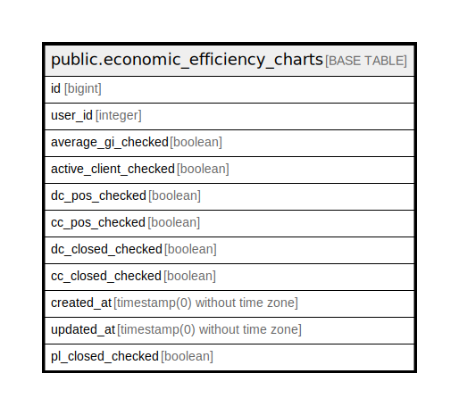

# public.economic_efficiency_charts

## Description

## Columns

| Name | Type | Default | Nullable | Children | Parents | Comment |
| ---- | ---- | ------- | -------- | -------- | ------- | ------- |
| id | bigint | nextval('economic_efficiency_charts_id_seq'::regclass) | false |  |  |  |
| user_id | integer |  | false |  |  |  |
| average_gi_checked | boolean | false | false |  |  |  |
| active_client_checked | boolean | false | false |  |  |  |
| dc_pos_checked | boolean | false | false |  |  |  |
| cc_pos_checked | boolean | false | false |  |  |  |
| dc_closed_checked | boolean | false | false |  |  |  |
| cc_closed_checked | boolean | false | false |  |  |  |
| created_at | timestamp(0) without time zone |  | true |  |  |  |
| updated_at | timestamp(0) without time zone |  | true |  |  |  |
| pl_closed_checked | boolean |  | true |  |  |  |

## Constraints

| Name | Type | Definition |
| ---- | ---- | ---------- |
| economic_efficiency_charts_pkey | PRIMARY KEY | PRIMARY KEY (id) |

## Indexes

| Name | Definition |
| ---- | ---------- |
| economic_efficiency_charts_pkey | CREATE UNIQUE INDEX economic_efficiency_charts_pkey ON public.economic_efficiency_charts USING btree (id) |

## Relations

---

> Generated by [tbls](https://github.com/k1LoW/tbls)
