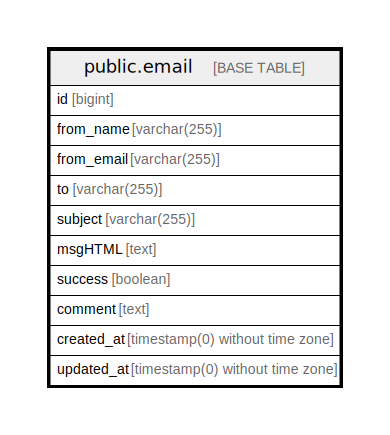

# public.email

## Description

## Columns

| Name | Type | Default | Nullable | Children | Parents | Comment |
| ---- | ---- | ------- | -------- | -------- | ------- | ------- |
| id | bigint | nextval('email_id_seq'::regclass) | false |  |  |  |
| from_name | varchar(255) |  | true |  |  |  |
| from_email | varchar(255) |  | true |  |  |  |
| to | varchar(255) |  | true |  |  |  |
| subject | varchar(255) |  | true |  |  |  |
| msgHTML | text |  | true |  |  |  |
| success | boolean | false | false |  |  |  |
| comment | text |  | true |  |  |  |
| created_at | timestamp(0) without time zone |  | true |  |  |  |
| updated_at | timestamp(0) without time zone |  | true |  |  |  |

## Constraints

| Name | Type | Definition |
| ---- | ---- | ---------- |
| email_pkey | PRIMARY KEY | PRIMARY KEY (id) |

## Indexes

| Name | Definition |
| ---- | ---------- |
| email_pkey | CREATE UNIQUE INDEX email_pkey ON public.email USING btree (id) |

## Relations

---

> Generated by [tbls](https://github.com/k1LoW/tbls)
