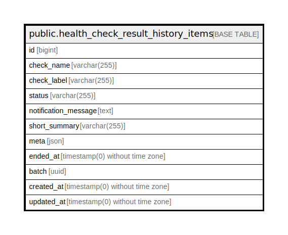

# public.health_check_result_history_items

## Description

## Columns

| Name | Type | Default | Nullable | Children | Parents | Comment |
| ---- | ---- | ------- | -------- | -------- | ------- | ------- |
| id | bigint | nextval('health_check_result_history_items_id_seq'::regclass) | false |  |  |  |
| check_name | varchar(255) |  | false |  |  |  |
| check_label | varchar(255) |  | false |  |  |  |
| status | varchar(255) |  | false |  |  |  |
| notification_message | text |  | true |  |  |  |
| short_summary | varchar(255) |  | true |  |  |  |
| meta | json |  | false |  |  |  |
| ended_at | timestamp(0) without time zone |  | false |  |  |  |
| batch | uuid |  | false |  |  |  |
| created_at | timestamp(0) without time zone |  | true |  |  |  |
| updated_at | timestamp(0) without time zone |  | true |  |  |  |

## Constraints

| Name | Type | Definition |
| ---- | ---- | ---------- |
| health_check_result_history_items_pkey | PRIMARY KEY | PRIMARY KEY (id) |

## Indexes

| Name | Definition |
| ---- | ---------- |
| health_check_result_history_items_pkey | CREATE UNIQUE INDEX health_check_result_history_items_pkey ON public.health_check_result_history_items USING btree (id) |
| health_check_result_history_items_batch_index | CREATE INDEX health_check_result_history_items_batch_index ON public.health_check_result_history_items USING btree (batch) |
| health_check_result_history_items_created_at_index | CREATE INDEX health_check_result_history_items_created_at_index ON public.health_check_result_history_items USING btree (created_at) |

## Relations

---

> Generated by [tbls](https://github.com/k1LoW/tbls)
