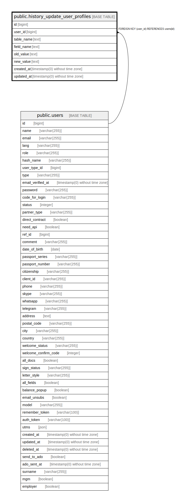

# public.history_update_user_profiles

## Description

## Columns

| Name | Type | Default | Nullable | Children | Parents | Comment |
| ---- | ---- | ------- | -------- | -------- | ------- | ------- |
| id | bigint | nextval('history_update_user_profiles_id_seq'::regclass) | false |  |  |  |
| user_id | bigint |  | false |  | [public.users](public.users.md) |  |
| table_name | text |  | true |  |  |  |
| field_name | text |  | true |  |  |  |
| old_value | text |  | true |  |  |  |
| new_value | text |  | true |  |  |  |
| created_at | timestamp(0) without time zone |  | true |  |  |  |
| updated_at | timestamp(0) without time zone |  | true |  |  |  |

## Constraints

| Name | Type | Definition |
| ---- | ---- | ---------- |
| history_update_user_profiles_pkey | PRIMARY KEY | PRIMARY KEY (id) |
| history_update_user_profiles_user_id_foreign | FOREIGN KEY | FOREIGN KEY (user_id) REFERENCES users(id) |

## Indexes

| Name | Definition |
| ---- | ---------- |
| history_update_user_profiles_pkey | CREATE UNIQUE INDEX history_update_user_profiles_pkey ON public.history_update_user_profiles USING btree (id) |

## Relations

---

> Generated by [tbls](https://github.com/k1LoW/tbls)
