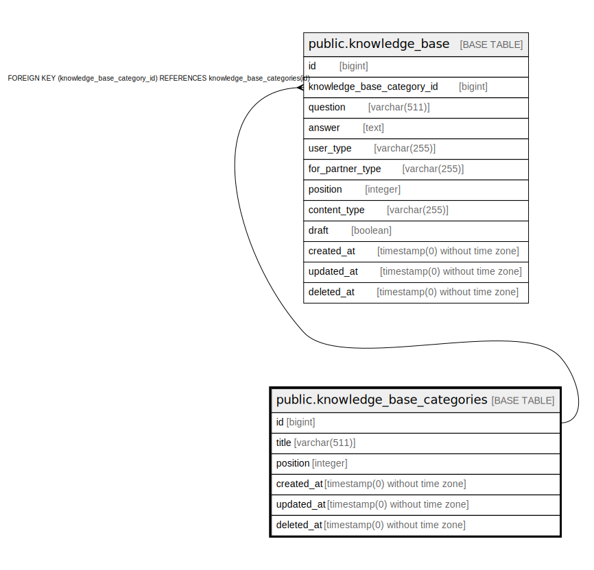

# public.knowledge_base_categories

## Description

## Columns

| Name | Type | Default | Nullable | Children | Parents | Comment |
| ---- | ---- | ------- | -------- | -------- | ------- | ------- |
| id | bigint | nextval('knowledge_base_categories_id_seq'::regclass) | false | [public.knowledge_base](public.knowledge_base.md) |  |  |
| title | varchar(511) |  | false |  |  |  |
| position | integer | 0 | false |  |  |  |
| created_at | timestamp(0) without time zone |  | true |  |  |  |
| updated_at | timestamp(0) without time zone |  | true |  |  |  |
| deleted_at | timestamp(0) without time zone |  | true |  |  |  |

## Constraints

| Name | Type | Definition |
| ---- | ---- | ---------- |
| knowledge_base_categories_pkey | PRIMARY KEY | PRIMARY KEY (id) |

## Indexes

| Name | Definition |
| ---- | ---------- |
| knowledge_base_categories_pkey | CREATE UNIQUE INDEX knowledge_base_categories_pkey ON public.knowledge_base_categories USING btree (id) |

## Relations

---

> Generated by [tbls](https://github.com/k1LoW/tbls)
