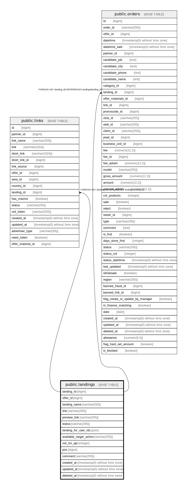

# public.landings

## Description

## Columns

| Name | Type | Default | Nullable | Children | Parents | Comment |
| ---- | ---- | ------- | -------- | -------- | ------- | ------- |
| landing_id | bigint | nextval('landings_landing_id_seq'::regclass) | false | [public.links](public.links.md) [public.orders](public.orders.md) |  |  |
| offer_id | bigint |  | false |  |  |  |
| landing_name | varchar(255) |  | false |  |  |  |
| link | varchar(255) |  | false |  |  |  |
| preview_link | varchar(255) |  | true |  |  |  |
| status | varchar(255) | 'active'::character varying | false |  |  |  |
| landing_for_user_ids | json |  | true |  |  |  |
| available_target_action | varchar(255) | 'all'::character varying | false |  |  |  |
| not_for_api | integer | 0 | false |  |  |  |
| pos | bigint | '0'::bigint | false |  |  |  |
| comment | varchar(255) |  | true |  |  |  |
| created_at | timestamp(0) without time zone |  | true |  |  |  |
| updated_at | timestamp(0) without time zone |  | true |  |  |  |
| deleted_at | timestamp(0) without time zone |  | true |  |  |  |

## Constraints

| Name | Type | Definition |
| ---- | ---- | ---------- |
| landings_available_target_action_check | CHECK | CHECK (((available_target_action)::text = ANY (ARRAY[('all'::character varying)::text, ('individual'::character varying)::text]))) |
| landings_pkey | PRIMARY KEY | PRIMARY KEY (landing_id) |

## Indexes

| Name | Definition |
| ---- | ---------- |
| landings_pkey | CREATE UNIQUE INDEX landings_pkey ON public.landings USING btree (landing_id) |

## Relations

---

> Generated by [tbls](https://github.com/k1LoW/tbls)
