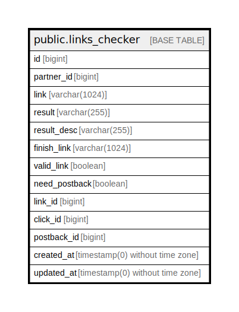

# public.links_checker

## Description

## Columns

| Name | Type | Default | Nullable | Children | Parents | Comment |
| ---- | ---- | ------- | -------- | -------- | ------- | ------- |
| id | bigint | nextval('links_checker_id_seq'::regclass) | false |  |  |  |
| partner_id | bigint |  | false |  |  |  |
| link | varchar(1024) |  | false |  |  |  |
| result | varchar(255) | 'in_progress'::character varying | false |  |  |  |
| result_desc | varchar(255) |  | true |  |  |  |
| finish_link | varchar(1024) |  | true |  |  |  |
| valid_link | boolean | false | false |  |  |  |
| need_postback | boolean | false | false |  |  |  |
| link_id | bigint |  | true |  |  |  |
| click_id | bigint |  | true |  |  |  |
| postback_id | bigint |  | true |  |  |  |
| created_at | timestamp(0) without time zone |  | true |  |  |  |
| updated_at | timestamp(0) without time zone |  | true |  |  |  |

## Constraints

| Name | Type | Definition |
| ---- | ---- | ---------- |
| links_checker_result_check | CHECK | CHECK (((result)::text = ANY (ARRAY[('in_progress'::character varying)::text, ('error'::character varying)::text, ('success'::character varying)::text]))) |
| links_checker_pkey | PRIMARY KEY | PRIMARY KEY (id) |

## Indexes

| Name | Definition |
| ---- | ---------- |
| links_checker_pkey | CREATE UNIQUE INDEX links_checker_pkey ON public.links_checker USING btree (id) |

## Relations

---

> Generated by [tbls](https://github.com/k1LoW/tbls)
