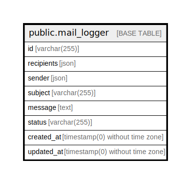

# public.mail_logger

## Description

## Columns

| Name | Type | Default | Nullable | Children | Parents | Comment |
| ---- | ---- | ------- | -------- | -------- | ------- | ------- |
| id | varchar(255) |  | false |  |  |  |
| recipients | json |  | false |  |  |  |
| sender | json |  | false |  |  |  |
| subject | varchar(255) |  | false |  |  |  |
| message | text |  | false |  |  |  |
| status | varchar(255) |  | false |  |  |  |
| created_at | timestamp(0) without time zone |  | true |  |  |  |
| updated_at | timestamp(0) without time zone |  | true |  |  |  |

## Constraints

| Name | Type | Definition |
| ---- | ---- | ---------- |
| mail_logger_pkey | PRIMARY KEY | PRIMARY KEY (id) |

## Indexes

| Name | Definition |
| ---- | ---------- |
| mail_logger_pkey | CREATE UNIQUE INDEX mail_logger_pkey ON public.mail_logger USING btree (id) |

## Relations

---

> Generated by [tbls](https://github.com/k1LoW/tbls)
