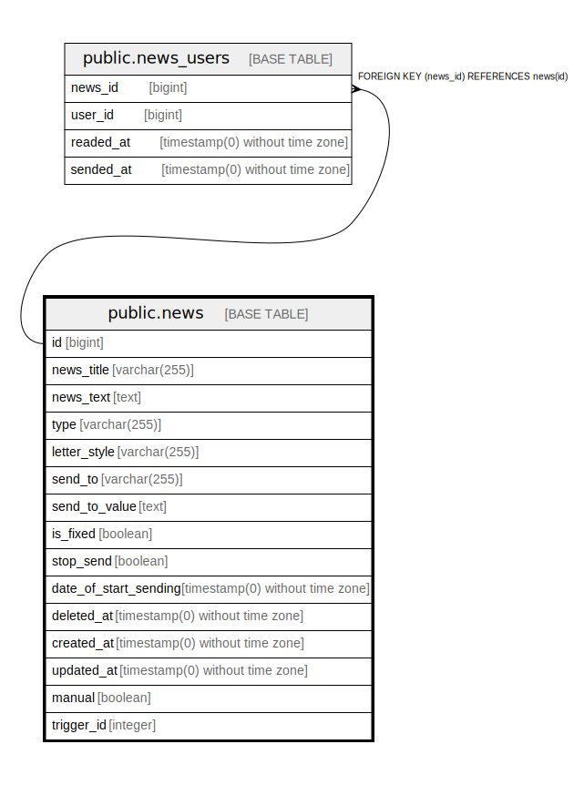

# public.news

## Description

## Columns

| Name | Type | Default | Nullable | Children | Parents | Comment |
| ---- | ---- | ------- | -------- | -------- | ------- | ------- |
| id | bigint | nextval('news_id_seq'::regclass) | false | [public.news_users](public.news_users.md) |  |  |
| news_title | varchar(255) |  | true |  |  |  |
| news_text | text |  | true |  |  |  |
| type | varchar(255) | 'news'::character varying | false |  |  |  |
| letter_style | varchar(255) |  | true |  |  | Признак стиля общения: формальный или неформальный |
| send_to | varchar(255) |  | true |  |  |  |
| send_to_value | text |  | true |  |  |  |
| is_fixed | boolean |  | true |  |  | если true  новость будет всегда показываться кабинет партнера |
| stop_send | boolean | false | false |  |  | при создании рассылки = 1 -  что означает что данная рассылка не будет рассылаться автоматически командой news:send-unsent |
| date_of_start_sending | timestamp(0) without time zone |  | true |  |  | Дата начала рассылки писем |
| deleted_at | timestamp(0) without time zone |  | true |  |  |  |
| created_at | timestamp(0) without time zone |  | true |  |  |  |
| updated_at | timestamp(0) without time zone |  | true |  |  |  |
| manual | boolean | false | true |  |  |  |
| trigger_id | integer |  | true |  |  |  |

## Constraints

| Name | Type | Definition |
| ---- | ---- | ---------- |
| news_pkey | PRIMARY KEY | PRIMARY KEY (id) |

## Indexes

| Name | Definition |
| ---- | ---------- |
| news_pkey | CREATE UNIQUE INDEX news_pkey ON public.news USING btree (id) |

## Relations

---

> Generated by [tbls](https://github.com/k1LoW/tbls)
