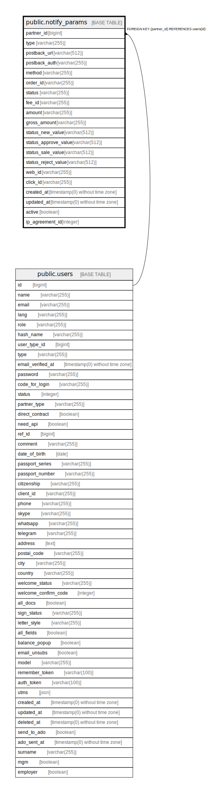

# public.notify_params

## Description

## Columns

| Name | Type | Default | Nullable | Children | Parents | Comment |
| ---- | ---- | ------- | -------- | -------- | ------- | ------- |
| partner_id | bigint |  | false |  | [public.users](public.users.md) |  |
| type | varchar(255) | 'default'::character varying | false |  |  |  |
| postback_url | varchar(512) |  | true |  |  |  |
| postback_auth | varchar(255) |  | true |  |  |  |
| method | varchar(255) | 'get'::character varying | false |  |  |  |
| order_id | varchar(255) |  | true |  |  |  |
| status | varchar(255) |  | true |  |  |  |
| fee_id | varchar(255) |  | true |  |  |  |
| amount | varchar(255) |  | true |  |  |  |
| gross_amount | varchar(255) |  | true |  |  |  |
| status_new_value | varchar(512) | 'new'::character varying | true |  |  |  |
| status_approve_value | varchar(512) | 'approve'::character varying | true |  |  |  |
| status_sale_value | varchar(512) | 'sale'::character varying | true |  |  |  |
| status_reject_value | varchar(512) | 'reject'::character varying | true |  |  |  |
| web_id | varchar(255) |  | true |  |  |  |
| click_id | varchar(255) |  | true |  |  |  |
| created_at | timestamp(0) without time zone |  | true |  |  |  |
| updated_at | timestamp(0) without time zone |  | true |  |  |  |
| active | boolean | true | false |  |  |  |
| ip_agreement_id | integer |  | true |  |  |  |

## Constraints

| Name | Type | Definition |
| ---- | ---- | ---------- |
| notify_params_pkey | PRIMARY KEY | PRIMARY KEY (partner_id) |
| notify_params_partner_id_foreign | FOREIGN KEY | FOREIGN KEY (partner_id) REFERENCES users(id) |

## Indexes

| Name | Definition |
| ---- | ---------- |
| notify_params_pkey | CREATE UNIQUE INDEX notify_params_pkey ON public.notify_params USING btree (partner_id) |

## Relations

---

> Generated by [tbls](https://github.com/k1LoW/tbls)
