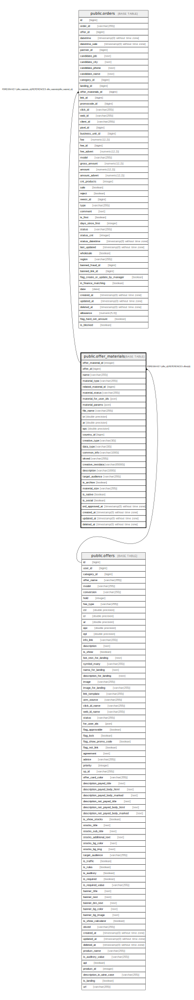

# public.offer_materials

## Description

## Columns

| Name | Type | Default | Nullable | Children | Parents | Comment |
| ---- | ---- | ------- | -------- | -------- | ------- | ------- |
| offer_material_id | integer | nextval('offer_materials_offer_material_id_seq'::regclass) | false | [public.orders](public.orders.md) |  |  |
| offer_id | bigint |  | false |  | [public.offers](public.offers.md) |  |
| name | varchar(255) |  | true |  |  |  |
| material_type | varchar(255) |  | false |  |  |  |
| related_material_id | bigint |  | true |  |  |  |
| material_status | varchar(255) | 'active'::character varying | false |  |  |  |
| material_for_user_ids | json |  | true |  |  |  |
| material_params | json |  | true |  |  | Параметры и настройки |
| file_name | varchar(255) |  | true |  |  | Прилагаемый файл |
| cr | double precision |  | true |  |  |  |
| ar | double precision |  | true |  |  |  |
| epc | double precision |  | true |  |  |  |
| country_id | bigint |  | true |  |  | Поле используется в некоторых зарубежных партнерках с материалом тип lending |
| creative_type | varchar(30) |  | false |  |  |  |
| data_type | varchar(30) |  | false |  |  |  |
| common_info | varchar(1000) |  | false |  |  |  |
| okved | varchar(255) |  | true |  |  |  |
| creative_textdata | varchar(65000) |  | true |  |  |  |
| description | varchar(1000) |  | true |  |  |  |
| target_audience | varchar(255) |  | true |  |  |  |
| is_archive | boolean |  | true |  |  |  |
| material_size | varchar(255) |  | true |  |  |  |
| is_native | boolean |  | true |  |  |  |
| is_social | boolean |  | true |  |  |  |
| ord_approved_at | timestamp(0) without time zone |  | true |  |  |  |
| created_at | timestamp(0) without time zone |  | true |  |  |  |
| updated_at | timestamp(0) without time zone |  | true |  |  |  |
| deleted_at | timestamp(0) without time zone |  | true |  |  |  |

## Constraints

| Name | Type | Definition |
| ---- | ---- | ---------- |
| offer_materials_pkey | PRIMARY KEY | PRIMARY KEY (offer_material_id) |
| offer_id | FOREIGN KEY | FOREIGN KEY (offer_id) REFERENCES offers(id) |

## Indexes

| Name | Definition |
| ---- | ---------- |
| offer_materials_pkey | CREATE UNIQUE INDEX offer_materials_pkey ON public.offer_materials USING btree (offer_material_id) |
| offer_materials_material_type_index | CREATE INDEX offer_materials_material_type_index ON public.offer_materials USING btree (material_type) |

## Relations

---

> Generated by [tbls](https://github.com/k1LoW/tbls)
