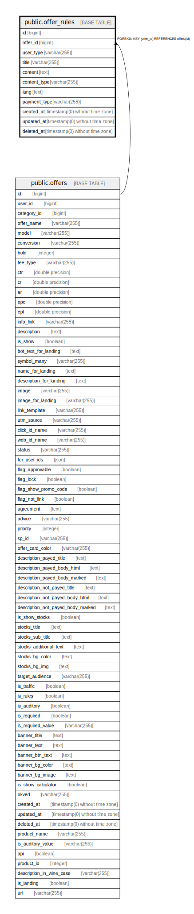

# public.offer_rules

## Description

## Columns

| Name | Type | Default | Nullable | Children | Parents | Comment |
| ---- | ---- | ------- | -------- | -------- | ------- | ------- |
| id | bigint | nextval('offer_rules_id_seq'::regclass) | false |  |  |  |
| offer_id | bigint |  | true |  | [public.offers](public.offers.md) |  |
| user_type | varchar(255) |  | true |  |  |  |
| title | varchar(255) |  | false |  |  |  |
| content | text |  | false |  |  |  |
| content_type | varchar(255) | 'text'::character varying | false |  |  |  |
| lang | text |  | true |  |  |  |
| payment_type | varchar(255) |  | true |  |  |  |
| created_at | timestamp(0) without time zone |  | true |  |  |  |
| updated_at | timestamp(0) without time zone |  | true |  |  |  |
| deleted_at | timestamp(0) without time zone |  | true |  |  |  |

## Constraints

| Name | Type | Definition |
| ---- | ---- | ---------- |
| offer_rules_pkey | PRIMARY KEY | PRIMARY KEY (id) |
| offer_rules_offer_id_foreign | FOREIGN KEY | FOREIGN KEY (offer_id) REFERENCES offers(id) |

## Indexes

| Name | Definition |
| ---- | ---------- |
| offer_rules_pkey | CREATE UNIQUE INDEX offer_rules_pkey ON public.offer_rules USING btree (id) |

## Relations

---

> Generated by [tbls](https://github.com/k1LoW/tbls)
