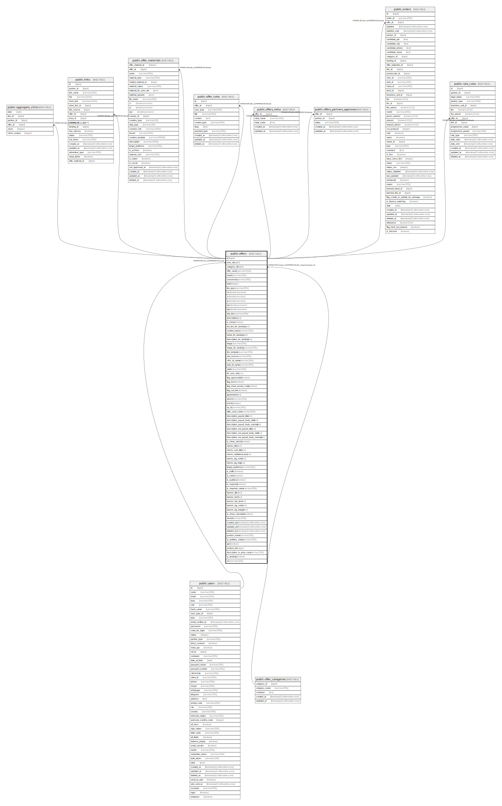

# public.offers

## Description

## Columns

| Name | Type | Default | Nullable | Children | Parents | Comment |
| ---- | ---- | ------- | -------- | -------- | ------- | ------- |
| id | bigint | nextval('offers_id_seq'::regclass) | false | [public.aggregate_clicks](public.aggregate_clicks.md) [public.links](public.links.md) [public.offer_materials](public.offer_materials.md) [public.offer_rules](public.offer_rules.md) [public.offers_meta](public.offers_meta.md) [public.offers_partners_approves](public.offers_partners_approves.md) [public.orders](public.orders.md) [public.rate_rules](public.rate_rules.md) |  |  |
| user_id | bigint |  | true |  | [public.users](public.users.md) |  |
| category_id | bigint |  | true |  | [public.offer_categories](public.offer_categories.md) |  |
| offer_name | varchar(255) |  | true |  |  |  |
| model | varchar(255) |  | true |  |  |  |
| conversion | varchar(255) |  | true |  |  |  |
| hold | integer |  | true |  |  |  |
| fee_type | varchar(255) |  | true |  |  |  |
| ctr | double precision | '0'::double precision | false |  |  |  |
| cr | double precision | '0'::double precision | false |  |  |  |
| ar | double precision | '0'::double precision | false |  |  |  |
| epc | double precision | '0'::double precision | false |  |  |  |
| epl | double precision | '0'::double precision | false |  |  |  |
| info_link | varchar(255) |  | true |  |  |  |
| description | text |  | true |  |  |  |
| is_show | boolean | false | false |  |  | Признака того открыт оффер для показа или нет |
| bot_text_for_landing | text |  | true |  |  |  |
| symbol_many | varchar(255) | '₽'::character varying | false |  |  |  |
| name_for_landing | text |  | true |  |  |  |
| description_for_landing | text |  | true |  |  |  |
| image | varchar(255) |  | true |  |  |  |
| image_for_landing | varchar(255) |  | true |  |  |  |
| link_template | varchar(255) |  | true |  |  |  |
| utm_source | varchar(255) |  | true |  |  |  |
| click_id_name | varchar(255) |  | true |  |  |  |
| web_id_name | varchar(255) |  | true |  |  |  |
| status | varchar(255) | 'active'::character varying | false |  |  |  |
| for_user_ids | json |  | true |  |  |  |
| flag_approvable | boolean | false | false |  |  |  |
| flag_lock | boolean | false | false |  |  | Признак что оффер закрыт до того как партнер не принял оферту |
| flag_show_promo_code | boolean | false | false |  |  | Если 1 в офере у партнера выводится промокод |
| flag_not_link | boolean | false | false |  |  | Если 1 в офере у партнера не показывается кнопка добавить ссылку |
| agreement | text |  | true |  |  |  |
| advice | varchar(255) |  | true |  |  |  |
| priority | integer |  | true |  |  |  |
| sp_id | varchar(255) |  | false |  |  |  |
| offer_card_color | varchar(255) |  | true |  |  | цвет карточки офера в описании |
| description_payed_title | text |  | true |  |  | название блока за что платим в карточке офера |
| description_payed_body_html | text |  | true |  |  | содержание блока за что платим в карточке офера в формате - html |
| description_payed_body_marked | text |  | true |  |  | содержание блока за что платим в карточке офера в формате - marked |
| description_not_payed_title | text |  | true |  |  | название блока за что не платим в карточке офера |
| description_not_payed_body_html | text |  | true |  |  | содержание блока за что не платим в карточке офера в формате - html |
| description_not_payed_body_marked | text |  | true |  |  | содержание блока за что не платим в карточке офера в формате - marked |
| is_show_stocks | boolean |  | true |  |  | поле отвечает за отображается или блок акций на странице |
| stocks_title | text |  | true |  |  | основной заголовок |
| stocks_sub_title | text |  | true |  |  | верхний заголовок блока акций |
| stocks_additional_text | text |  | true |  |  | дополнительный текст блока акций |
| stocks_bg_color | text |  | true |  |  | цвет заднего фона блока акций |
| stocks_bg_img | text |  | true |  |  | изображение заднего фона блока акций |
| target_audience | varchar(255) |  | true |  |  |  |
| is_traffic | boolean | true | false |  |  | показывать/скрывать блок источников трафика в слайдере |
| is_rules | boolean | true | false |  |  | показывать/скрывать блок правил в слайдере |
| is_auditory | boolean | true | false |  |  | показывать/скрывать блок аудитории в слайдере |
| is_required | boolean | true | false |  |  | показывать/скрывать блок требований к заемщику в слайдере |
| is_required_value | varchar(255) | 'credit_card'::character varying | false |  |  | для какого продукта показывать требования к заемщику |
| banner_title | text |  | true |  |  | основной заголовок |
| banner_text | text |  | true |  |  | текст блока баннеры |
| banner_btn_text | text |  | true |  |  | текст кнопки блока баннеры |
| banner_bg_color | text |  | true |  |  | цвет заднего фона блока баннеры |
| banner_bg_image | text |  | true |  |  | изображение заднего фона блока баннеры |
| is_show_calculator | boolean |  | true |  |  | Признак того показывать ли калькулятор в оффере |
| okved | varchar(255) |  | true |  |  |  |
| created_at | timestamp(0) without time zone |  | true |  |  |  |
| updated_at | timestamp(0) without time zone |  | true |  |  |  |
| deleted_at | timestamp(0) without time zone |  | true |  |  |  |
| product_name | varchar(255) |  | true |  |  |  |
| is_auditory_value | varchar(255) | 'credit_card'::character varying | false |  |  | для какого продукта показывать требования к заемщику |
| api | boolean | false | false |  |  |  |
| product_id | integer |  | true |  |  |  |
| description_in_wine_case | varchar(255) |  | false |  |  | значение оффера в винительном падеже для лендинга |
| is_landing | boolean | false | false |  |  | Признака того оффер показан на лендинге или нет |
| url | varchar(255) |  | true |  |  |  |

## Constraints

| Name | Type | Definition |
| ---- | ---- | ---------- |
| offers_category_id_foreign | FOREIGN KEY | FOREIGN KEY (category_id) REFERENCES offer_categories(category_id) |
| offers_pkey | PRIMARY KEY | PRIMARY KEY (id) |
| offers_user_id_foreign | FOREIGN KEY | FOREIGN KEY (user_id) REFERENCES users(id) |

## Indexes

| Name | Definition |
| ---- | ---------- |
| offers_pkey | CREATE UNIQUE INDEX offers_pkey ON public.offers USING btree (id) |

## Relations

---

> Generated by [tbls](https://github.com/k1LoW/tbls)
