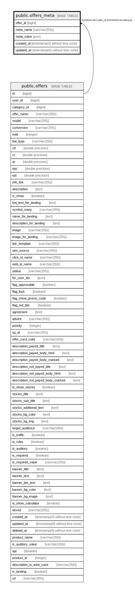

# public.offers_meta

## Description

## Columns

| Name | Type | Default | Nullable | Children | Parents | Comment |
| ---- | ---- | ------- | -------- | -------- | ------- | ------- |
| offer_id | bigint |  | false |  | [public.offers](public.offers.md) |  |
| meta_name | varchar(255) |  | false |  |  |  |
| meta_value | json |  | false |  |  |  |
| created_at | timestamp(0) without time zone |  | true |  |  |  |
| updated_at | timestamp(0) without time zone |  | true |  |  |  |

## Constraints

| Name | Type | Definition |
| ---- | ---- | ---------- |
| offers_meta_pkey | PRIMARY KEY | PRIMARY KEY (offer_id, meta_name) |
| pk | FOREIGN KEY | FOREIGN KEY (offer_id) REFERENCES offers(id) |

## Indexes

| Name | Definition |
| ---- | ---------- |
| offers_meta_pkey | CREATE UNIQUE INDEX offers_meta_pkey ON public.offers_meta USING btree (offer_id, meta_name) |
| offers_meta_meta_name_index | CREATE INDEX offers_meta_meta_name_index ON public.offers_meta USING btree (meta_name) |

## Relations

---

> Generated by [tbls](https://github.com/k1LoW/tbls)
