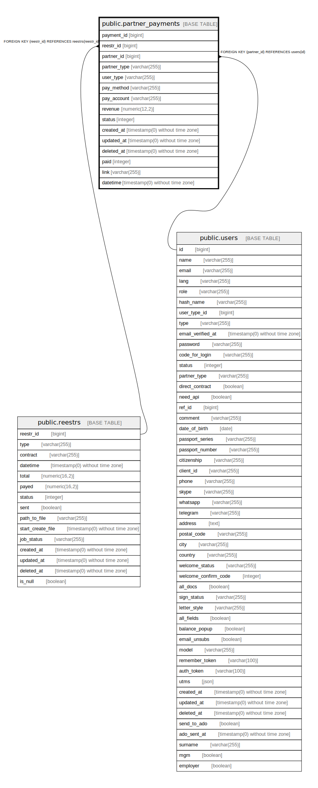

# public.partner_payments

## Description

## Columns

| Name | Type | Default | Nullable | Children | Parents | Comment |
| ---- | ---- | ------- | -------- | -------- | ------- | ------- |
| payment_id | bigint | nextval('partner_payments_payment_id_seq'::regclass) | false |  |  |  |
| reestr_id | bigint |  | true |  | [public.reestrs](public.reestrs.md) |  |
| partner_id | bigint |  | true |  | [public.users](public.users.md) |  |
| partner_type | varchar(255) |  | true |  |  |  |
| user_type | varchar(255) |  | true |  |  |  |
| pay_method | varchar(255) |  | true |  |  |  |
| pay_account | varchar(255) |  | true |  |  |  |
| revenue | numeric(12,2) |  | false |  |  |  |
| status | integer | 0 | true |  |  |  |
| created_at | timestamp(0) without time zone |  | true |  |  |  |
| updated_at | timestamp(0) without time zone |  | true |  |  |  |
| deleted_at | timestamp(0) without time zone |  | true |  |  |  |
| paid | integer | 0 | false |  |  |  |
| link | varchar(255) |  | true |  |  |  |
| datetime | timestamp(0) without time zone |  | true |  |  | дата реестра |

## Constraints

| Name | Type | Definition |
| ---- | ---- | ---------- |
| partner_payments_pkey | PRIMARY KEY | PRIMARY KEY (payment_id) |
| partner_payments_reestr_id_foreign | FOREIGN KEY | FOREIGN KEY (reestr_id) REFERENCES reestrs(reestr_id) |
| partner_payments_partner_id_foreign | FOREIGN KEY | FOREIGN KEY (partner_id) REFERENCES users(id) |

## Indexes

| Name | Definition |
| ---- | ---------- |
| partner_payments_pkey | CREATE UNIQUE INDEX partner_payments_pkey ON public.partner_payments USING btree (payment_id) |

## Relations

---

> Generated by [tbls](https://github.com/k1LoW/tbls)
