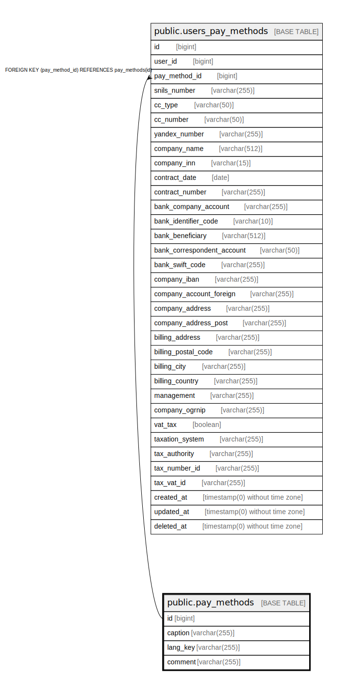

# public.pay_methods

## Description

## Columns

| Name | Type | Default | Nullable | Children | Parents | Comment |
| ---- | ---- | ------- | -------- | -------- | ------- | ------- |
| id | bigint | nextval('pay_methods_id_seq'::regclass) | false | [public.users_pay_methods](public.users_pay_methods.md) |  |  |
| caption | varchar(255) |  | false |  |  |  |
| lang_key | varchar(255) |  | true |  |  |  |
| comment | varchar(255) |  | true |  |  |  |

## Constraints

| Name | Type | Definition |
| ---- | ---- | ---------- |
| pay_methods_pkey | PRIMARY KEY | PRIMARY KEY (id) |

## Indexes

| Name | Definition |
| ---- | ---------- |
| pay_methods_pkey | CREATE UNIQUE INDEX pay_methods_pkey ON public.pay_methods USING btree (id) |

## Relations

---

> Generated by [tbls](https://github.com/k1LoW/tbls)
