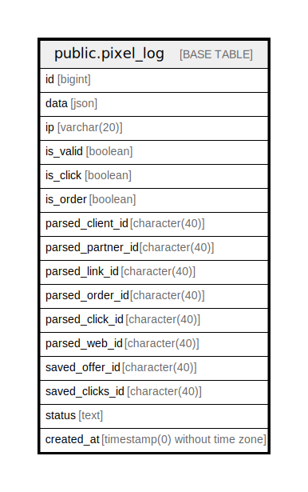

# public.pixel_log

## Description

## Columns

| Name | Type | Default | Nullable | Children | Parents | Comment |
| ---- | ---- | ------- | -------- | -------- | ------- | ------- |
| id | bigint | nextval('pixel_log_id_seq'::regclass) | false |  |  |  |
| data | json |  | false |  |  |  |
| ip | varchar(20) |  | true |  |  |  |
| is_valid | boolean |  | true |  |  |  |
| is_click | boolean |  | true |  |  |  |
| is_order | boolean |  | true |  |  |  |
| parsed_client_id | character(40) |  | true |  |  |  |
| parsed_partner_id | character(40) |  | true |  |  |  |
| parsed_link_id | character(40) |  | true |  |  |  |
| parsed_order_id | character(40) |  | true |  |  |  |
| parsed_click_id | character(40) |  | true |  |  |  |
| parsed_web_id | character(40) |  | true |  |  |  |
| saved_offer_id | character(40) |  | true |  |  |  |
| saved_clicks_id | character(40) |  | true |  |  |  |
| status | text |  | true |  |  |  |
| created_at | timestamp(0) without time zone |  | true |  |  |  |

## Constraints

| Name | Type | Definition |
| ---- | ---- | ---------- |
| pixel_log_pkey | PRIMARY KEY | PRIMARY KEY (id) |

## Indexes

| Name | Definition |
| ---- | ---------- |
| pixel_log_pkey | CREATE UNIQUE INDEX pixel_log_pkey ON public.pixel_log USING btree (id) |
| is_click | CREATE INDEX is_click ON public.pixel_log USING btree (is_click) |
| is_order | CREATE INDEX is_order ON public.pixel_log USING btree (is_order) |
| is_valid | CREATE INDEX is_valid ON public.pixel_log USING btree (is_valid) |

## Relations

---

> Generated by [tbls](https://github.com/k1LoW/tbls)
