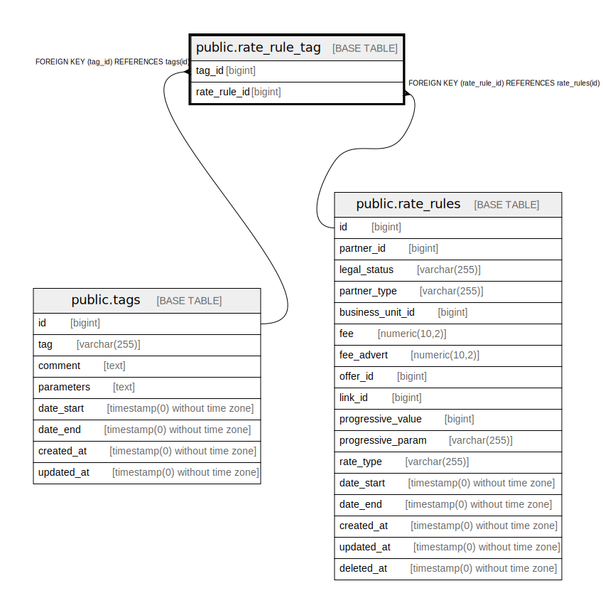

# public.rate_rule_tag

## Description

## Columns

| Name | Type | Default | Nullable | Children | Parents | Comment |
| ---- | ---- | ------- | -------- | -------- | ------- | ------- |
| tag_id | bigint |  | false |  | [public.tags](public.tags.md) |  |
| rate_rule_id | bigint |  | false |  | [public.rate_rules](public.rate_rules.md) |  |

## Constraints

| Name | Type | Definition |
| ---- | ---- | ---------- |
| rate_rule_tag_rate_rule_id_foreign | FOREIGN KEY | FOREIGN KEY (rate_rule_id) REFERENCES rate_rules(id) |
| rate_rule_tag_tag_id_foreign | FOREIGN KEY | FOREIGN KEY (tag_id) REFERENCES tags(id) |

## Relations

---

> Generated by [tbls](https://github.com/k1LoW/tbls)
