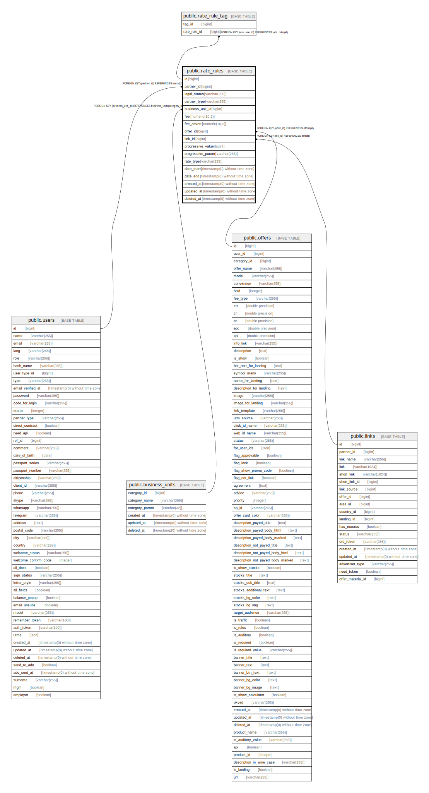

# public.rate_rules

## Description

## Columns

| Name | Type | Default | Nullable | Children | Parents | Comment |
| ---- | ---- | ------- | -------- | -------- | ------- | ------- |
| id | bigint | nextval('rate_rules_id_seq'::regclass) | false | [public.rate_rule_tag](public.rate_rule_tag.md) |  |  |
| partner_id | bigint |  | true |  | [public.users](public.users.md) |  |
| legal_status | varchar(255) |  | true |  |  |  |
| partner_type | varchar(255) |  | true |  |  | Поле users.partner_type |
| business_unit_id | bigint |  | true |  | [public.business_units](public.business_units.md) |  |
| fee | numeric(10,2) |  | true |  |  | Ставка для БЮ |
| fee_advert | numeric(10,2) | '0'::numeric | false |  |  |  |
| offer_id | bigint |  | false |  | [public.offers](public.offers.md) |  |
| link_id | bigint |  | true |  | [public.links](public.links.md) |  |
| progressive_value | bigint | '0'::bigint | true |  |  | Мин. значение для срабатывания прогрессивной ставки |
| progressive_param | varchar(255) |  | true |  |  | Параметр, учитываемый в ставке(оборот, кол-во заявок) |
| rate_type | varchar(255) | 'default'::character varying | false |  |  |  |
| date_start | timestamp(0) without time zone |  | false |  |  | Дата старта |
| date_end | timestamp(0) without time zone |  | true |  |  | Дата окончания |
| created_at | timestamp(0) without time zone |  | true |  |  |  |
| updated_at | timestamp(0) without time zone |  | true |  |  |  |
| deleted_at | timestamp(0) without time zone |  | true |  |  |  |

## Constraints

| Name | Type | Definition |
| ---- | ---- | ---------- |
| business_unit_id | FOREIGN KEY | FOREIGN KEY (business_unit_id) REFERENCES business_units(category_id) |
| rate_rules_link_id_foreign | FOREIGN KEY | FOREIGN KEY (link_id) REFERENCES links(id) |
| pk | FOREIGN KEY | FOREIGN KEY (offer_id) REFERENCES offers(id) |
| rate_rules_pkey | PRIMARY KEY | PRIMARY KEY (id) |
| partner_id | FOREIGN KEY | FOREIGN KEY (partner_id) REFERENCES users(id) |

## Indexes

| Name | Definition |
| ---- | ---------- |
| rate_rules_pkey | CREATE UNIQUE INDEX rate_rules_pkey ON public.rate_rules USING btree (id) |

## Relations

---

> Generated by [tbls](https://github.com/k1LoW/tbls)
