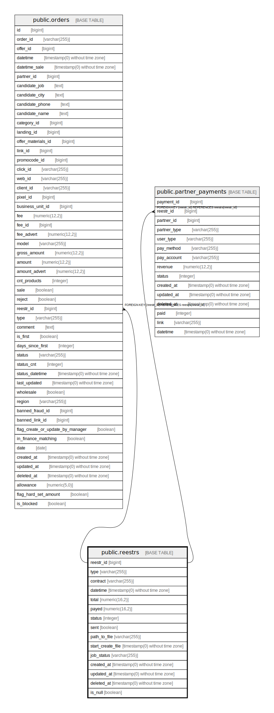

# public.reestrs

## Description

## Columns

| Name | Type | Default | Nullable | Children | Parents | Comment |
| ---- | ---- | ------- | -------- | -------- | ------- | ------- |
| reestr_id | bigint | nextval('reestrs_reestr_id_seq'::regclass) | false | [public.orders](public.orders.md) [public.partner_payments](public.partner_payments.md) |  |  |
| type | varchar(255) |  | true |  |  |  |
| contract | varchar(255) |  | true |  |  |  |
| datetime | timestamp(0) without time zone |  | true |  |  |  |
| total | numeric(16,2) | '0'::numeric | true |  |  |  |
| payed | numeric(16,2) | '0'::numeric | true |  |  |  |
| status | integer | 0 | true |  |  |  |
| sent | boolean | false | false |  |  |  |
| path_to_file | varchar(255) |  | true |  |  |  |
| start_create_file | timestamp(0) without time zone |  | true |  |  |  |
| job_status | varchar(255) | 'stop'::character varying | false |  |  | статус процессов реестра stop - нет процессов, create - процесс создания реестра, delete - процесс обновления реестра, update - процесс обновления реестров |
| created_at | timestamp(0) without time zone |  | true |  |  |  |
| updated_at | timestamp(0) without time zone |  | true |  |  |  |
| deleted_at | timestamp(0) without time zone |  | true |  |  |  |
| is_null | boolean | true | false |  |  |  |

## Constraints

| Name | Type | Definition |
| ---- | ---- | ---------- |
| reestrs_pkey | PRIMARY KEY | PRIMARY KEY (reestr_id) |

## Indexes

| Name | Definition |
| ---- | ---------- |
| reestrs_pkey | CREATE UNIQUE INDEX reestrs_pkey ON public.reestrs USING btree (reestr_id) |

## Relations

---

> Generated by [tbls](https://github.com/k1LoW/tbls)
