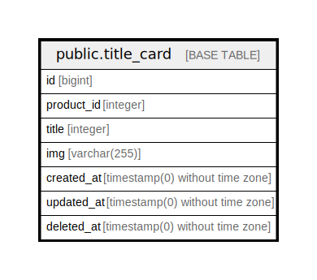

# public.title_card

## Description

## Columns

| Name | Type | Default | Nullable | Children | Parents | Comment |
| ---- | ---- | ------- | -------- | -------- | ------- | ------- |
| id | bigint | nextval('title_card_id_seq'::regclass) | false |  |  |  |
| product_id | integer |  | false |  |  |  |
| title | integer |  | false |  |  |  |
| img | varchar(255) |  | true |  |  |  |
| created_at | timestamp(0) without time zone |  | true |  |  |  |
| updated_at | timestamp(0) without time zone |  | true |  |  |  |
| deleted_at | timestamp(0) without time zone |  | true |  |  |  |

## Constraints

| Name | Type | Definition |
| ---- | ---- | ---------- |
| title_card_pkey | PRIMARY KEY | PRIMARY KEY (id) |

## Indexes

| Name | Definition |
| ---- | ---------- |
| title_card_pkey | CREATE UNIQUE INDEX title_card_pkey ON public.title_card USING btree (id) |

## Relations

---

> Generated by [tbls](https://github.com/k1LoW/tbls)
