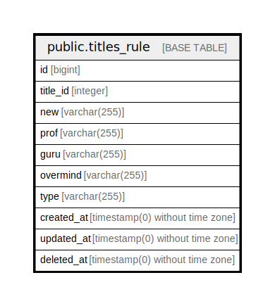

# public.titles_rule

## Description

## Columns

| Name | Type | Default | Nullable | Children | Parents | Comment |
| ---- | ---- | ------- | -------- | -------- | ------- | ------- |
| id | bigint | nextval('titles_rule_id_seq'::regclass) | false |  |  |  |
| title_id | integer |  | false |  |  |  |
| new | varchar(255) |  | false |  |  |  |
| prof | varchar(255) |  | false |  |  |  |
| guru | varchar(255) |  | false |  |  |  |
| overmind | varchar(255) |  | false |  |  |  |
| type | varchar(255) |  | false |  |  |  |
| created_at | timestamp(0) without time zone |  | true |  |  |  |
| updated_at | timestamp(0) without time zone |  | true |  |  |  |
| deleted_at | timestamp(0) without time zone |  | true |  |  |  |

## Constraints

| Name | Type | Definition |
| ---- | ---- | ---------- |
| titles_rule_pkey | PRIMARY KEY | PRIMARY KEY (id) |

## Indexes

| Name | Definition |
| ---- | ---------- |
| titles_rule_pkey | CREATE UNIQUE INDEX titles_rule_pkey ON public.titles_rule USING btree (id) |
| titles_rule_id_index | CREATE INDEX titles_rule_id_index ON public.titles_rule USING btree (id) |

## Relations

---

> Generated by [tbls](https://github.com/k1LoW/tbls)
