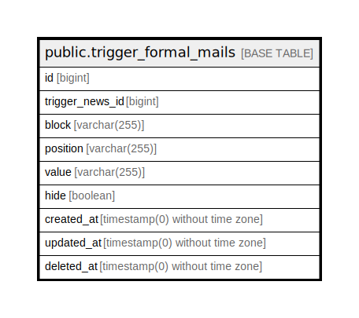

# public.trigger_formal_mails

## Description

## Columns

| Name | Type | Default | Nullable | Children | Parents | Comment |
| ---- | ---- | ------- | -------- | -------- | ------- | ------- |
| id | bigint | nextval('trigger_formal_mails_id_seq'::regclass) | false |  |  |  |
| trigger_news_id | bigint |  | true |  |  |  |
| block | varchar(255) |  | true |  |  |  |
| position | varchar(255) |  | true |  |  |  |
| value | varchar(255) |  | true |  |  |  |
| hide | boolean |  | true |  |  |  |
| created_at | timestamp(0) without time zone |  | true |  |  |  |
| updated_at | timestamp(0) without time zone |  | true |  |  |  |
| deleted_at | timestamp(0) without time zone |  | true |  |  |  |

## Constraints

| Name | Type | Definition |
| ---- | ---- | ---------- |
| trigger_formal_mails_pkey | PRIMARY KEY | PRIMARY KEY (id) |

## Indexes

| Name | Definition |
| ---- | ---------- |
| trigger_formal_mails_pkey | CREATE UNIQUE INDEX trigger_formal_mails_pkey ON public.trigger_formal_mails USING btree (id) |

## Relations

---

> Generated by [tbls](https://github.com/k1LoW/tbls)
