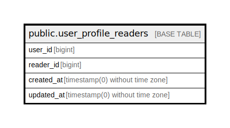

# public.user_profile_readers

## Description

## Columns

| Name | Type | Default | Nullable | Children | Parents | Comment |
| ---- | ---- | ------- | -------- | -------- | ------- | ------- |
| user_id | bigint |  | false |  |  |  |
| reader_id | bigint |  | false |  |  |  |
| created_at | timestamp(0) without time zone |  | true |  |  |  |
| updated_at | timestamp(0) without time zone |  | true |  |  |  |

## Constraints

| Name | Type | Definition |
| ---- | ---- | ---------- |
| user_profile_readers_user_id_reader_id_unique | UNIQUE | UNIQUE (user_id, reader_id) |

## Indexes

| Name | Definition |
| ---- | ---------- |
| user_profile_readers_user_id_reader_id_unique | CREATE UNIQUE INDEX user_profile_readers_user_id_reader_id_unique ON public.user_profile_readers USING btree (user_id, reader_id) |

## Relations

---

> Generated by [tbls](https://github.com/k1LoW/tbls)
