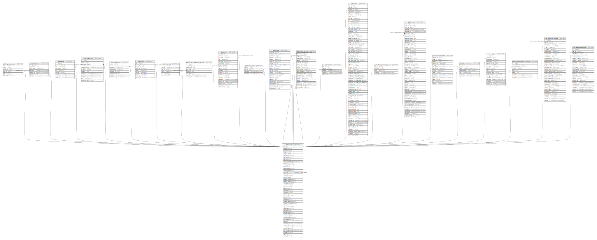

# public.users

## Description

## Columns

| Name | Type | Default | Nullable | Children | Parents | Comment |
| ---- | ---- | ------- | -------- | -------- | ------- | ------- |
| id | bigint | nextval('users_id_seq'::regclass) | false | [public.aggregate_clicks](public.aggregate_clicks.md) [public.api_tokens](public.api_tokens.md) [public.areas](public.areas.md) [public.broken_links](public.broken_links.md) [public.changes_log](public.changes_log.md) [public.clicks](public.clicks.md) [public.enter_log](public.enter_log.md) [public.history_update_user_profiles](public.history_update_user_profiles.md) [public.links](public.links.md) [public.news_users](public.news_users.md) [public.notify](public.notify.md) [public.notify_params](public.notify_params.md) [public.ofertas](public.ofertas.md) [public.offers](public.offers.md) [public.offers_partners_approves](public.offers_partners_approves.md) [public.orders](public.orders.md) [public.partner_payments](public.partner_payments.md) [public.partner_turnovers](public.partner_turnovers.md) [public.rate_rules](public.rate_rules.md) [public.servicedesk_task_comments](public.servicedesk_task_comments.md) [public.users](public.users.md) [public.users_pay_methods](public.users_pay_methods.md) [public.users_personal_data](public.users_personal_data.md) |  |  |
| name | varchar(255) |  | false |  |  |  |
| email | varchar(255) |  | false |  |  |  |
| lang | varchar(255) |  | true |  |  |  |
| role | varchar(255) | 'partner'::character varying | false |  |  |  |
| hash_name | varchar(255) |  | true |  |  |  |
| user_type_id | bigint | '2'::bigint | false |  |  |  |
| type | varchar(255) |  | true |  |  |  |
| email_verified_at | timestamp(0) without time zone |  | true |  |  |  |
| password | varchar(255) |  | false |  |  |  |
| code_for_login | varchar(255) |  | true |  |  | Код который используется при авторизации через телефон, или email по такому-же  принципу |
| status | integer | 0 | false |  |  |  |
| partner_type | varchar(255) | 'webmaster'::character varying | false |  |  |  |
| direct_contract | boolean | false | false |  |  |  |
| need_api | boolean | false | false |  |  |  |
| ref_id | bigint |  | true |  | [public.users](public.users.md) | id - материнского реферала |
| comment | varchar(255) |  | true |  |  |  |
| date_of_birth | date |  | true |  |  |  |
| passport_series | varchar(255) |  | true |  |  |  |
| passport_number | varchar(255) |  | true |  |  |  |
| citizenship | varchar(255) |  | true |  |  |  |
| client_id | varchar(255) |  | true |  |  |  |
| phone | varchar(255) |  | true |  |  |  |
| skype | varchar(255) |  | true |  |  |  |
| whatsapp | varchar(255) |  | true |  |  |  |
| telegram | varchar(255) |  | true |  |  |  |
| address | text |  | true |  |  |  |
| postal_code | varchar(255) |  | true |  |  |  |
| city | varchar(255) |  | true |  |  |  |
| country | varchar(255) |  | true |  |  |  |
| welcome_status | varchar(255) |  | true |  |  |  |
| welcome_confirm_code | integer |  | true |  |  |  |
| all_docs | boolean | false | false |  |  |  |
| sign_status | varchar(255) |  | true |  |  |  |
| letter_style | varchar(255) | 'formal'::character varying | false |  |  |  |
| all_fields | boolean | false | false |  |  |  |
| balance_popup | boolean | false | false |  |  |  |
| email_unsubs | boolean | false | false |  |  |  |
| model | varchar(255) | 'sale'::character varying | false |  |  |  |
| remember_token | varchar(100) |  | true |  |  |  |
| auth_token | varchar(100) |  | true |  |  |  |
| utms | json |  | true |  |  | UTM-метки, с которыми зарегистрировался пользователь |
| created_at | timestamp(0) without time zone |  | true |  |  |  |
| updated_at | timestamp(0) without time zone |  | true |  |  |  |
| deleted_at | timestamp(0) without time zone |  | true |  |  |  |
| send_to_ado | boolean | false | false |  |  |  |
| ado_sent_at | timestamp(0) without time zone |  | true |  |  |  |
| surname | varchar(255) |  | true |  |  |  |
| mgm | boolean | false | false |  |  |  |
| employer | boolean |  | true |  |  |  |

## Constraints

| Name | Type | Definition |
| ---- | ---- | ---------- |
| users_auth_token_unique | UNIQUE | UNIQUE (auth_token) |
| users_email_unique | UNIQUE | UNIQUE (email) |
| users_pkey | PRIMARY KEY | PRIMARY KEY (id) |
| users_ref_id_foreign | FOREIGN KEY | FOREIGN KEY (ref_id) REFERENCES users(id) |

## Indexes

| Name | Definition |
| ---- | ---------- |
| users_auth_token_unique | CREATE UNIQUE INDEX users_auth_token_unique ON public.users USING btree (auth_token) |
| users_email_unique | CREATE UNIQUE INDEX users_email_unique ON public.users USING btree (email) |
| users_pkey | CREATE UNIQUE INDEX users_pkey ON public.users USING btree (id) |

## Relations

---

> Generated by [tbls](https://github.com/k1LoW/tbls)
