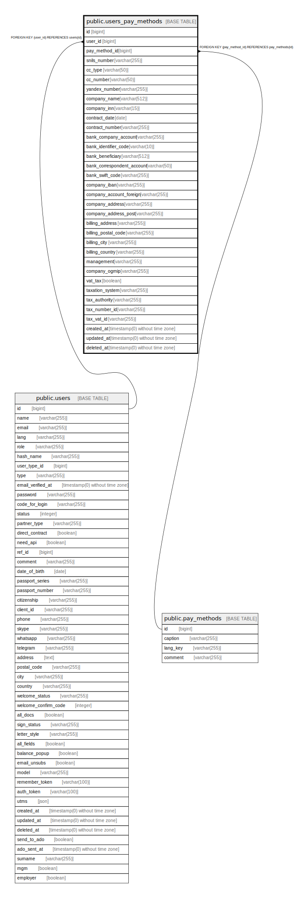

# public.users_pay_methods

## Description

## Columns

| Name | Type | Default | Nullable | Children | Parents | Comment |
| ---- | ---- | ------- | -------- | -------- | ------- | ------- |
| id | bigint | nextval('users_pay_methods_id_seq'::regclass) | false |  |  |  |
| user_id | bigint |  | false |  | [public.users](public.users.md) |  |
| pay_method_id | bigint |  | false |  | [public.pay_methods](public.pay_methods.md) |  |
| snils_number | varchar(255) |  | true |  |  | СНИЛС для физических лиц |
| cc_type | varchar(50) |  | true |  |  |  |
| cc_number | varchar(50) |  | true |  |  |  |
| yandex_number | varchar(255) |  | true |  |  |  |
| company_name | varchar(512) |  | true |  |  | Наименование |
| company_inn | varchar(15) |  | true |  |  | ИНН |
| contract_date | date |  | true |  |  |  |
| contract_number | varchar(255) |  | true |  |  |  |
| bank_company_account | varchar(255) |  | true |  |  | Номер расчетного счета |
| bank_identifier_code | varchar(10) |  | true |  |  | БИК |
| bank_beneficiary | varchar(512) |  | true |  |  | Название банка |
| bank_correspondent_account | varchar(50) |  | true |  |  | Корр. счет |
| bank_swift_code | varchar(255) |  | true |  |  | Для иностранных партнеров: BIC или SWIFT банка |
| company_iban | varchar(255) |  | true |  |  | Для иностранных партнеров: счет - IBAN |
| company_account_foreign | varchar(255) |  | true |  |  | Для иностранных партнеров: счет в банке - не IBAN |
| company_address | varchar(255) |  | true |  |  |  |
| company_address_post | varchar(255) |  | true |  |  | Фактический или почтовый адрес |
| billing_address | varchar(255) |  | true |  |  | Для иностранных партнеров |
| billing_postal_code | varchar(255) |  | true |  |  | Для иностранных партнеров |
| billing_city | varchar(255) |  | true |  |  | Для иностранных партнеров |
| billing_country | varchar(255) |  | true |  |  | Для иностранных партнеров |
| management | varchar(255) |  | true |  |  | Должность и ФИО руководителя |
| company_ogrnip | varchar(255) |  | true |  |  | ОГРНИП (номер ИП) или ОГРН (номер юрлица) |
| vat_tax | boolean |  | true |  |  |  |
| taxation_system | varchar(255) |  | true |  |  |  |
| tax_authority | varchar(255) |  | true |  |  | Для иностранных партнеров: налоговый орган |
| tax_number_id | varchar(255) |  | true |  |  | Для иностранных партнеров: ИНН |
| tax_vat_id | varchar(255) |  | true |  |  | Для иностранных партнеров: Код для НДС |
| created_at | timestamp(0) without time zone |  | true |  |  |  |
| updated_at | timestamp(0) without time zone |  | true |  |  |  |
| deleted_at | timestamp(0) without time zone |  | true |  |  |  |

## Constraints

| Name | Type | Definition |
| ---- | ---- | ---------- |
| users_pay_methods_pay_method_id_foreign | FOREIGN KEY | FOREIGN KEY (pay_method_id) REFERENCES pay_methods(id) |
| users_pay_methods_pkey | PRIMARY KEY | PRIMARY KEY (id) |
| users_pay_methods_user_id_foreign | FOREIGN KEY | FOREIGN KEY (user_id) REFERENCES users(id) |

## Indexes

| Name | Definition |
| ---- | ---------- |
| users_pay_methods_pkey | CREATE UNIQUE INDEX users_pay_methods_pkey ON public.users_pay_methods USING btree (id) |

## Relations

---

> Generated by [tbls](https://github.com/k1LoW/tbls)
