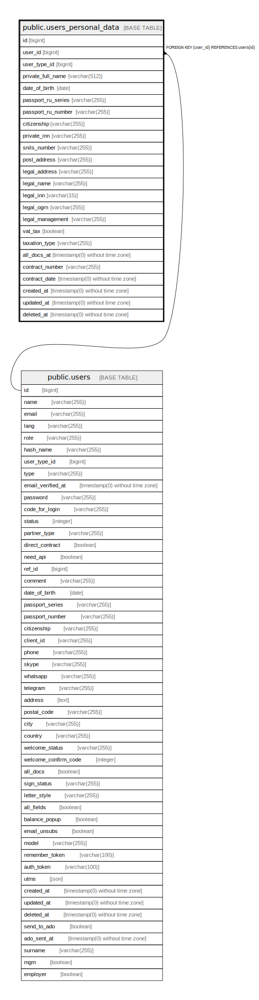

# public.users_personal_data

## Description

## Columns

| Name | Type | Default | Nullable | Children | Parents | Comment |
| ---- | ---- | ------- | -------- | -------- | ------- | ------- |
| id | bigint | nextval('users_personal_data_id_seq'::regclass) | false |  |  |  |
| user_id | bigint |  | false |  | [public.users](public.users.md) |  |
| user_type_id | bigint |  | false |  |  |  |
| private_full_name | varchar(512) |  | true |  |  | Полное имя / ФИО по документам |
| date_of_birth | date |  | true |  |  |  |
| passport_ru_series | varchar(255) |  | true |  |  |  |
| passport_ru_number | varchar(255) |  | true |  |  |  |
| citizenship | varchar(255) |  | true |  |  |  |
| private_inn | varchar(255) |  | true |  |  | ИНН физлица или самозанятого |
| snils_number | varchar(255) |  | true |  |  | СНИЛС для физических лиц |
| post_address | varchar(255) |  | true |  |  | Фактический или почтовый адрес |
| legal_address | varchar(255) |  | true |  |  | Адрес регистрации |
| legal_name | varchar(255) |  | true |  |  | Наименование Юр.Лица |
| legal_inn | varchar(15) |  | true |  |  | ИНН |
| legal_ogrn | varchar(255) |  | true |  |  | ОГРНИП (номер ИП) или ОГРН (номер юрлица) |
| legal_management | varchar(255) |  | true |  |  | Должность и ФИО руководителя |
| vat_tax | boolean |  | true |  |  | Плательщик НДС - да/нет |
| taxation_type | varchar(255) |  | true |  |  | Тип/система налогообложения |
| all_docs_at | timestamp(0) without time zone |  | true |  |  |  |
| contract_number | varchar(255) |  | true |  |  |  |
| contract_date | timestamp(0) without time zone |  | true |  |  |  |
| created_at | timestamp(0) without time zone |  | true |  |  |  |
| updated_at | timestamp(0) without time zone |  | true |  |  |  |
| deleted_at | timestamp(0) without time zone |  | true |  |  |  |

## Constraints

| Name | Type | Definition |
| ---- | ---- | ---------- |
| users_personal_data_pkey | PRIMARY KEY | PRIMARY KEY (id) |
| users_personal_data_user_id_foreign | FOREIGN KEY | FOREIGN KEY (user_id) REFERENCES users(id) |

## Indexes

| Name | Definition |
| ---- | ---------- |
| users_personal_data_pkey | CREATE UNIQUE INDEX users_personal_data_pkey ON public.users_personal_data USING btree (id) |

## Relations

---

> Generated by [tbls](https://github.com/k1LoW/tbls)
