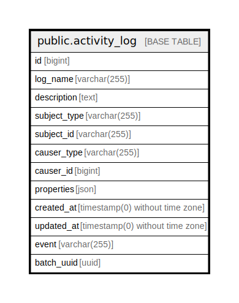

# public.activity_log

## Description

## Columns

| Name | Type | Default | Nullable | Children | Parents | Comment |
| ---- | ---- | ------- | -------- | -------- | ------- | ------- |
| id | bigint | nextval('activity_log_id_seq'::regclass) | false |  |  |  |
| log_name | varchar(255) |  | true |  |  |  |
| description | text |  | false |  |  |  |
| subject_type | varchar(255) |  | true |  |  |  |
| subject_id | varchar(255) |  | true |  |  |  |
| causer_type | varchar(255) |  | true |  |  |  |
| causer_id | bigint |  | true |  |  |  |
| properties | json |  | true |  |  |  |
| created_at | timestamp(0) without time zone |  | true |  |  |  |
| updated_at | timestamp(0) without time zone |  | true |  |  |  |
| event | varchar(255) |  | true |  |  |  |
| batch_uuid | uuid |  | true |  |  |  |

## Constraints

| Name | Type | Definition |
| ---- | ---- | ---------- |
| activity_log_pkey | PRIMARY KEY | PRIMARY KEY (id) |

## Indexes

| Name | Definition |
| ---- | ---------- |
| activity_log_pkey | CREATE UNIQUE INDEX activity_log_pkey ON public.activity_log USING btree (id) |
| activity_log_log_name_index | CREATE INDEX activity_log_log_name_index ON public.activity_log USING btree (log_name) |
| causer | CREATE INDEX causer ON public.activity_log USING btree (causer_type, causer_id) |
| subject | CREATE INDEX subject ON public.activity_log USING btree (subject_type, subject_id) |

## Relations

---

> Generated by [tbls](https://github.com/k1LoW/tbls)
