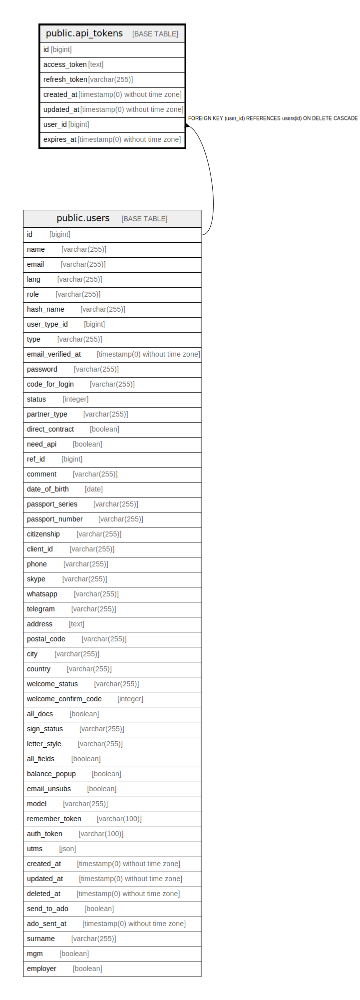

# public.api_tokens

## Description

## Columns

| Name | Type | Default | Nullable | Children | Parents | Comment |
| ---- | ---- | ------- | -------- | -------- | ------- | ------- |
| id | bigint | nextval('api_tokens_id_seq'::regclass) | false |  |  |  |
| access_token | text |  | false |  |  |  |
| refresh_token | varchar(255) |  | false |  |  |  |
| created_at | timestamp(0) without time zone |  | true |  |  |  |
| updated_at | timestamp(0) without time zone |  | true |  |  |  |
| user_id | bigint |  | false |  | [public.users](public.users.md) |  |
| expires_at | timestamp(0) without time zone |  | false |  |  |  |

## Constraints

| Name | Type | Definition |
| ---- | ---- | ---------- |
| api_tokens_pkey | PRIMARY KEY | PRIMARY KEY (id) |
| api_tokens_user_id_foreign | FOREIGN KEY | FOREIGN KEY (user_id) REFERENCES users(id) ON DELETE CASCADE |

## Indexes

| Name | Definition |
| ---- | ---------- |
| api_tokens_pkey | CREATE UNIQUE INDEX api_tokens_pkey ON public.api_tokens USING btree (id) |
| api_tokens_refresh_token_index | CREATE INDEX api_tokens_refresh_token_index ON public.api_tokens USING btree (refresh_token) |

## Relations

---

> Generated by [tbls](https://github.com/k1LoW/tbls)
