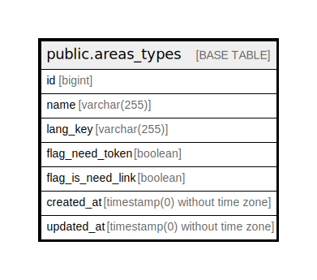

# public.areas_types

## Description

## Columns

| Name | Type | Default | Nullable | Children | Parents | Comment |
| ---- | ---- | ------- | -------- | -------- | ------- | ------- |
| id | bigint | nextval('areas_types_id_seq'::regclass) | false |  |  |  |
| name | varchar(255) |  | false |  |  |  |
| lang_key | varchar(255) |  | false |  |  |  |
| flag_need_token | boolean |  | false |  |  |  |
| flag_is_need_link | boolean | false | false |  |  | Флаг показывающий нужна ли площадке ссылка |
| created_at | timestamp(0) without time zone |  | true |  |  |  |
| updated_at | timestamp(0) without time zone |  | true |  |  |  |

## Constraints

| Name | Type | Definition |
| ---- | ---- | ---------- |
| areas_types_pkey | PRIMARY KEY | PRIMARY KEY (id) |

## Indexes

| Name | Definition |
| ---- | ---------- |
| areas_types_pkey | CREATE UNIQUE INDEX areas_types_pkey ON public.areas_types USING btree (id) |

## Relations

---

> Generated by [tbls](https://github.com/k1LoW/tbls)
