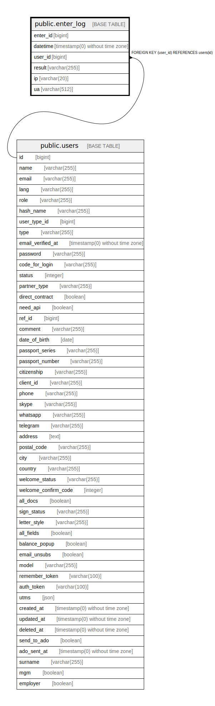

# public.enter_log

## Description

## Columns

| Name | Type | Default | Nullable | Children | Parents | Comment |
| ---- | ---- | ------- | -------- | -------- | ------- | ------- |
| enter_id | bigint | nextval('enter_log_enter_id_seq'::regclass) | false |  |  |  |
| datetime | timestamp(0) without time zone |  | true |  |  |  |
| user_id | bigint |  | false |  | [public.users](public.users.md) |  |
| result | varchar(255) | 'fail'::character varying | true |  |  |  |
| ip | varchar(20) |  | false |  |  |  |
| ua | varchar(512) |  | true |  |  |  |

## Constraints

| Name | Type | Definition |
| ---- | ---- | ---------- |
| enter_log_pkey | PRIMARY KEY | PRIMARY KEY (enter_id) |
| enter_log_user_id_foreign | FOREIGN KEY | FOREIGN KEY (user_id) REFERENCES users(id) |

## Indexes

| Name | Definition |
| ---- | ---------- |
| enter_log_pkey | CREATE UNIQUE INDEX enter_log_pkey ON public.enter_log USING btree (enter_id) |

## Relations

---

> Generated by [tbls](https://github.com/k1LoW/tbls)
