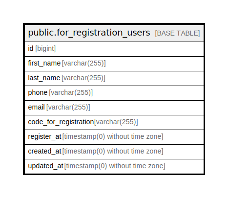

# public.for_registration_users

## Description

## Columns

| Name | Type | Default | Nullable | Children | Parents | Comment |
| ---- | ---- | ------- | -------- | -------- | ------- | ------- |
| id | bigint | nextval('for_registration_users_id_seq'::regclass) | false |  |  |  |
| first_name | varchar(255) |  | true |  |  |  |
| last_name | varchar(255) |  | true |  |  |  |
| phone | varchar(255) |  | true |  |  |  |
| email | varchar(255) |  | true |  |  |  |
| code_for_registration | varchar(255) |  | true |  |  |  |
| register_at | timestamp(0) without time zone |  | true |  |  |  |
| created_at | timestamp(0) without time zone |  | true |  |  |  |
| updated_at | timestamp(0) without time zone |  | true |  |  |  |

## Constraints

| Name | Type | Definition |
| ---- | ---- | ---------- |
| for_registration_users_phone_unique | UNIQUE | UNIQUE (phone) |
| for_registration_users_pkey | PRIMARY KEY | PRIMARY KEY (id) |

## Indexes

| Name | Definition |
| ---- | ---------- |
| for_registration_users_phone_unique | CREATE UNIQUE INDEX for_registration_users_phone_unique ON public.for_registration_users USING btree (phone) |
| for_registration_users_pkey | CREATE UNIQUE INDEX for_registration_users_pkey ON public.for_registration_users USING btree (id) |

## Relations

---

> Generated by [tbls](https://github.com/k1LoW/tbls)
