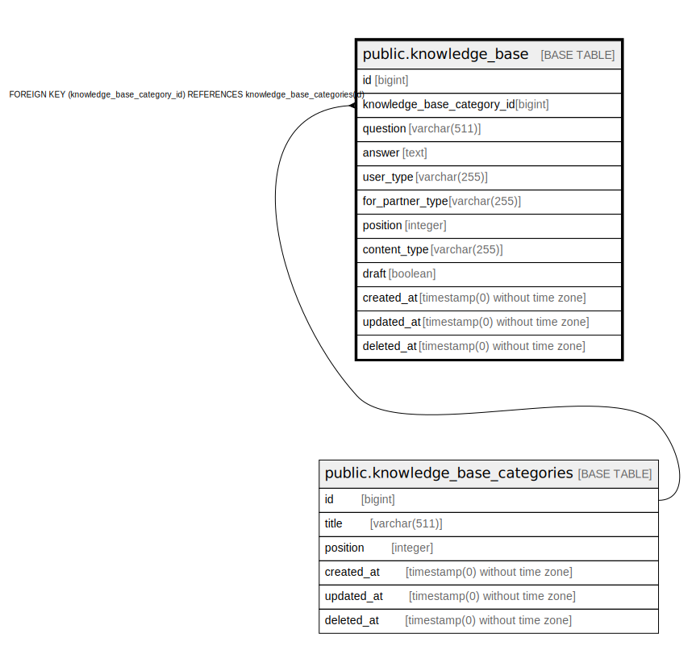

# public.knowledge_base

## Description

## Columns

| Name | Type | Default | Nullable | Children | Parents | Comment |
| ---- | ---- | ------- | -------- | -------- | ------- | ------- |
| id | bigint | nextval('knowledge_base_id_seq'::regclass) | false |  |  |  |
| knowledge_base_category_id | bigint |  | true |  | [public.knowledge_base_categories](public.knowledge_base_categories.md) |  |
| question | varchar(511) |  | false |  |  |  |
| answer | text |  | true |  |  |  |
| user_type | varchar(255) |  | true |  |  |  |
| for_partner_type | varchar(255) |  | true |  |  |  |
| position | integer | 0 | false |  |  |  |
| content_type | varchar(255) | 'text'::character varying | false |  |  |  |
| draft | boolean | false | false |  |  | если 1 - значит вопрос имеет статус черновик, и не виден у партнеров |
| created_at | timestamp(0) without time zone |  | true |  |  |  |
| updated_at | timestamp(0) without time zone |  | true |  |  |  |
| deleted_at | timestamp(0) without time zone |  | true |  |  |  |

## Constraints

| Name | Type | Definition |
| ---- | ---- | ---------- |
| knowledge_base_knowledge_base_category_id_foreign | FOREIGN KEY | FOREIGN KEY (knowledge_base_category_id) REFERENCES knowledge_base_categories(id) |
| knowledge_base_pkey | PRIMARY KEY | PRIMARY KEY (id) |

## Indexes

| Name | Definition |
| ---- | ---------- |
| knowledge_base_pkey | CREATE UNIQUE INDEX knowledge_base_pkey ON public.knowledge_base USING btree (id) |

## Relations

---

> Generated by [tbls](https://github.com/k1LoW/tbls)
