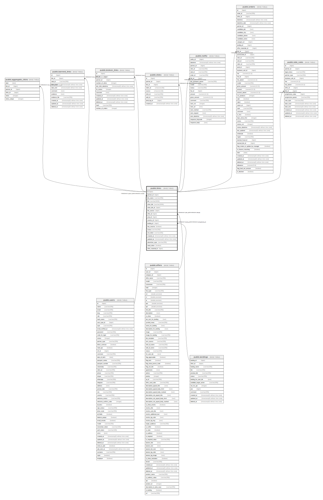

# public.links

## Description

## Columns

| Name | Type | Default | Nullable | Children | Parents | Comment |
| ---- | ---- | ------- | -------- | -------- | ------- | ------- |
| id | bigint | nextval('links_id_seq'::regclass) | false | [public.aggregate_clicks](public.aggregate_clicks.md) [public.banned_links](public.banned_links.md) [public.broken_links](public.broken_links.md) [public.clicks](public.clicks.md) [public.notify](public.notify.md) [public.orders](public.orders.md) [public.rate_rules](public.rate_rules.md) |  |  |
| partner_id | bigint |  | false |  | [public.users](public.users.md) |  |
| link_name | varchar(255) |  | false |  |  |  |
| link | varchar(1024) | ''::character varying | false |  |  |  |
| short_link | varchar(1024) | ''::character varying | false |  |  |  |
| short_link_id | bigint |  | true |  |  |  |
| link_source | bigint |  | true |  |  |  |
| offer_id | bigint |  | true |  | [public.offers](public.offers.md) |  |
| area_id | bigint |  | true |  |  | id - площадки |
| country_id | bigint |  | true |  |  | Поле используется не на всех партнерках |
| landing_id | bigint |  | true |  | [public.landings](public.landings.md) |  |
| has_macros | boolean | false | false |  |  |  |
| status | varchar(255) | 'ACTIVE'::character varying | false |  |  |  |
| ord_token | varchar(255) |  | true |  |  |  |
| created_at | timestamp(0) without time zone |  | true |  |  |  |
| updated_at | timestamp(0) without time zone |  | true |  |  |  |
| advertiser_type | varchar(255) |  | true |  |  | Признак рекламы |
| need_token | boolean | false | false |  |  |  |
| offer_material_id | bigint |  | true |  |  |  |

## Constraints

| Name | Type | Definition |
| ---- | ---- | ---------- |
| links_landing_id_foreign | FOREIGN KEY | FOREIGN KEY (landing_id) REFERENCES landings(landing_id) |
| links_pkey | PRIMARY KEY | PRIMARY KEY (id) |
| links_offer_id_foreign | FOREIGN KEY | FOREIGN KEY (offer_id) REFERENCES offers(id) |
| links_partner_id_foreign | FOREIGN KEY | FOREIGN KEY (partner_id) REFERENCES users(id) |

## Indexes

| Name | Definition |
| ---- | ---------- |
| links_pkey | CREATE UNIQUE INDEX links_pkey ON public.links USING btree (id) |

## Relations

---

> Generated by [tbls](https://github.com/k1LoW/tbls)
