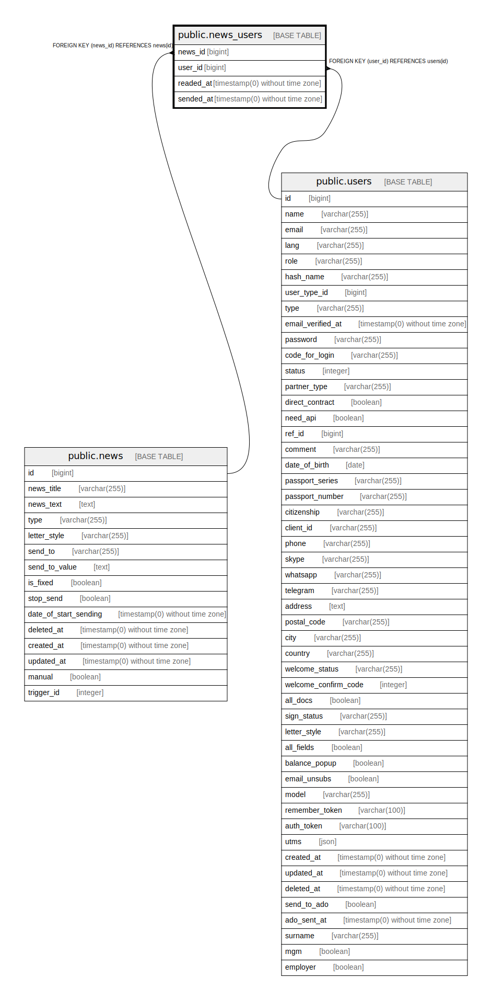

# public.news_users

## Description

## Columns

| Name | Type | Default | Nullable | Children | Parents | Comment |
| ---- | ---- | ------- | -------- | -------- | ------- | ------- |
| news_id | bigint |  | false |  | [public.news](public.news.md) |  |
| user_id | bigint |  | false |  | [public.users](public.users.md) |  |
| readed_at | timestamp(0) without time zone |  | true |  |  |  |
| sended_at | timestamp(0) without time zone |  | true |  |  |  |

## Constraints

| Name | Type | Definition |
| ---- | ---- | ---------- |
| news_users_news_id_foreign | FOREIGN KEY | FOREIGN KEY (news_id) REFERENCES news(id) |
| news_users_news_id_user_id_unique | UNIQUE | UNIQUE (news_id, user_id) |
| news_users_user_id_foreign | FOREIGN KEY | FOREIGN KEY (user_id) REFERENCES users(id) |

## Indexes

| Name | Definition |
| ---- | ---------- |
| news_users_news_id_user_id_unique | CREATE UNIQUE INDEX news_users_news_id_user_id_unique ON public.news_users USING btree (news_id, user_id) |

## Relations

---

> Generated by [tbls](https://github.com/k1LoW/tbls)
