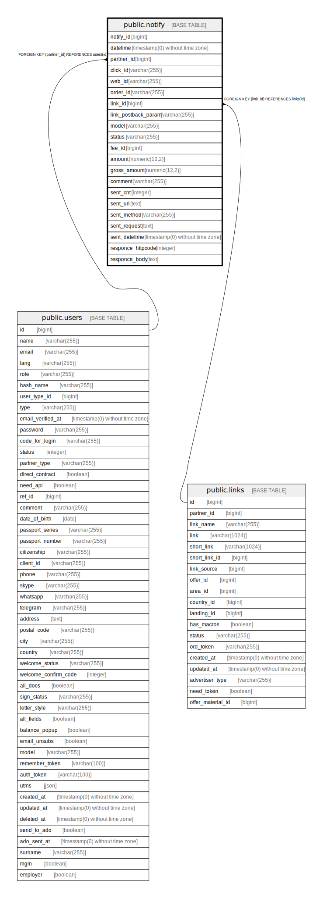

# public.notify

## Description

## Columns

| Name | Type | Default | Nullable | Children | Parents | Comment |
| ---- | ---- | ------- | -------- | -------- | ------- | ------- |
| notify_id | bigint | nextval('notify_notify_id_seq'::regclass) | false |  |  |  |
| datetime | timestamp(0) without time zone | CURRENT_TIMESTAMP | false |  |  |  |
| partner_id | bigint |  | true |  | [public.users](public.users.md) |  |
| click_id | varchar(255) | ''::character varying | true |  |  |  |
| web_id | varchar(255) |  | true |  |  |  |
| order_id | varchar(255) |  | true |  |  |  |
| link_id | bigint |  | true |  | [public.links](public.links.md) |  |
| link_postback_param | varchar(255) |  | true |  |  |  |
| model | varchar(255) |  | true |  |  |  |
| status | varchar(255) | 'new'::character varying | true |  |  |  |
| fee_id | bigint |  | true |  |  |  |
| amount | numeric(12,2) | '0'::numeric | true |  |  |  |
| gross_amount | numeric(12,2) | '0'::numeric | true |  |  |  |
| comment | varchar(255) |  | true |  |  |  |
| sent_cnt | integer | 0 | false |  |  |  |
| sent_url | text |  | true |  |  |  |
| sent_method | varchar(255) |  | true |  |  |  |
| sent_request | text |  | true |  |  |  |
| sent_datetime | timestamp(0) without time zone |  | true |  |  |  |
| responce_httpcode | integer |  | true |  |  |  |
| responce_body | text |  | true |  |  |  |

## Constraints

| Name | Type | Definition |
| ---- | ---- | ---------- |
| notify_link_id_foreign | FOREIGN KEY | FOREIGN KEY (link_id) REFERENCES links(id) |
| notify_pkey | PRIMARY KEY | PRIMARY KEY (notify_id) |
| unique | UNIQUE | UNIQUE (order_id, status, sent_cnt) |
| notify_partner_id_foreign | FOREIGN KEY | FOREIGN KEY (partner_id) REFERENCES users(id) |

## Indexes

| Name | Definition |
| ---- | ---------- |
| notify_pkey | CREATE UNIQUE INDEX notify_pkey ON public.notify USING btree (notify_id) |
| unique | CREATE UNIQUE INDEX "unique" ON public.notify USING btree (order_id, status, sent_cnt) |
| http_code | CREATE INDEX http_code ON public.notify USING btree (responce_httpcode) |

## Relations

---

> Generated by [tbls](https://github.com/k1LoW/tbls)
