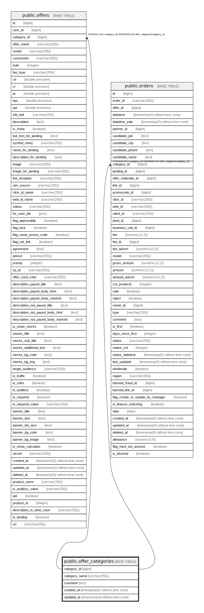

# public.offer_categories

## Description

## Columns

| Name | Type | Default | Nullable | Children | Parents | Comment |
| ---- | ---- | ------- | -------- | -------- | ------- | ------- |
| category_id | bigint | nextval('offer_categories_category_id_seq'::regclass) | false | [public.offers](public.offers.md) [public.orders](public.orders.md) |  |  |
| category_name | varchar(255) |  | false |  |  |  |
| comment | text |  | false |  |  |  |
| created_at | timestamp(0) without time zone |  | true |  |  |  |
| updated_at | timestamp(0) without time zone |  | true |  |  |  |

## Constraints

| Name | Type | Definition |
| ---- | ---- | ---------- |
| offer_categories_pkey | PRIMARY KEY | PRIMARY KEY (category_id) |

## Indexes

| Name | Definition |
| ---- | ---------- |
| offer_categories_pkey | CREATE UNIQUE INDEX offer_categories_pkey ON public.offer_categories USING btree (category_id) |

## Relations

---

> Generated by [tbls](https://github.com/k1LoW/tbls)
