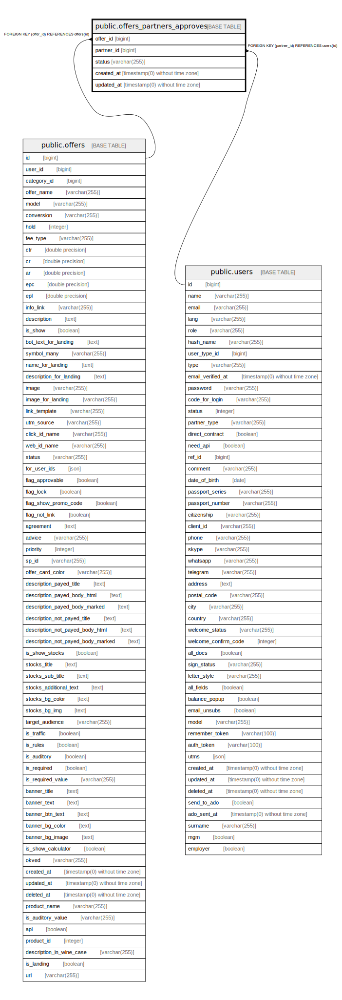

# public.offers_partners_approves

## Description

## Columns

| Name | Type | Default | Nullable | Children | Parents | Comment |
| ---- | ---- | ------- | -------- | -------- | ------- | ------- |
| offer_id | bigint |  | false |  | [public.offers](public.offers.md) |  |
| partner_id | bigint |  | false |  | [public.users](public.users.md) |  |
| status | varchar(255) | 'pending'::character varying | false |  |  |  |
| created_at | timestamp(0) without time zone |  | true |  |  |  |
| updated_at | timestamp(0) without time zone |  | true |  |  |  |

## Constraints

| Name | Type | Definition |
| ---- | ---- | ---------- |
| offers_partners_approves_status_check | CHECK | CHECK (((status)::text = ANY (ARRAY[('pending'::character varying)::text, ('approved'::character varying)::text, ('declined'::character varying)::text]))) |
| offers_partners_approves_offer_id_foreign | FOREIGN KEY | FOREIGN KEY (offer_id) REFERENCES offers(id) |
| offers_partners_approves_partner_id_foreign | FOREIGN KEY | FOREIGN KEY (partner_id) REFERENCES users(id) |

## Relations

---

> Generated by [tbls](https://github.com/k1LoW/tbls)
