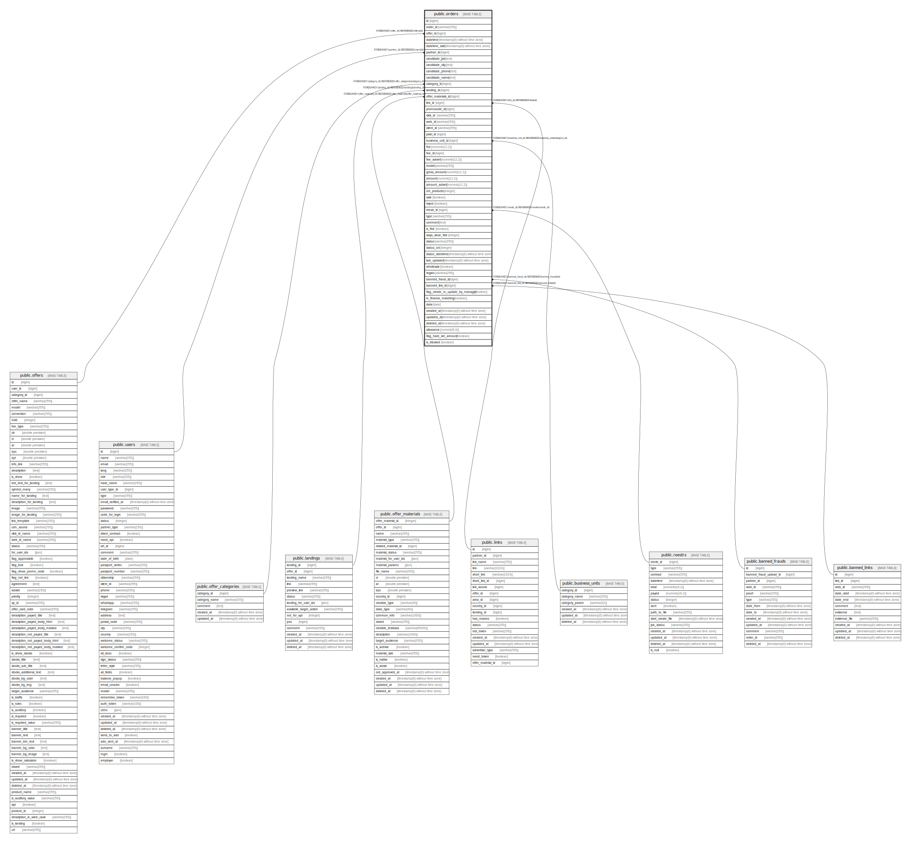

# public.orders

## Description

## Columns

| Name | Type | Default | Nullable | Children | Parents | Comment |
| ---- | ---- | ------- | -------- | -------- | ------- | ------- |
| id | bigint | nextval('orders_id_seq'::regclass) | false |  |  |  |
| order_id | varchar(255) |  | true |  |  |  |
| offer_id | bigint |  | false |  | [public.offers](public.offers.md) |  |
| datetime | timestamp(0) without time zone |  | true |  |  |  |
| datetime_sale | timestamp(0) without time zone |  | true |  |  |  |
| partner_id | bigint |  | true |  | [public.users](public.users.md) |  |
| candidate_job | text |  | true |  |  |  |
| candidate_city | text |  | true |  |  |  |
| candidate_phone | text |  | true |  |  |  |
| candidate_name | text |  | true |  |  |  |
| category_id | bigint |  | true |  | [public.offer_categories](public.offer_categories.md) |  |
| landing_id | bigint |  | true |  | [public.landings](public.landings.md) |  |
| offer_materials_id | bigint |  | true |  | [public.offer_materials](public.offer_materials.md) |  |
| link_id | bigint |  | true |  | [public.links](public.links.md) |  |
| promocode_id | bigint |  | true |  |  |  |
| click_id | varchar(255) |  | true |  |  |  |
| web_id | varchar(255) |  | true |  |  |  |
| client_id | varchar(255) |  | true |  |  |  |
| pixel_id | bigint |  | true |  |  |  |
| business_unit_id | bigint |  | true |  | [public.business_units](public.business_units.md) |  |
| fee | numeric(12,2) | '0'::numeric | true |  |  |  |
| fee_id | bigint |  | true |  |  |  |
| fee_advert | numeric(12,2) |  | true |  |  |  |
| model | varchar(255) |  | true |  |  |  |
| gross_amount | numeric(12,2) |  | true |  |  |  |
| amount | numeric(12,2) | '0'::numeric | true |  |  |  |
| amount_advert | numeric(12,2) | '0'::numeric | true |  |  |  |
| cnt_products | integer | 0 | false |  |  |  |
| sale | boolean | false | true |  |  |  |
| reject | boolean | false | true |  |  |  |
| reestr_id | bigint |  | true |  | [public.reestrs](public.reestrs.md) |  |
| type | varchar(255) | 'order'::character varying | false |  |  |  |
| comment | text |  | true |  |  |  |
| is_first | boolean | false | false |  |  | Признак первой заявки |
| days_since_first | integer |  | true |  |  | Количество дней с первой заявки у клиента |
| status | varchar(255) |  | true |  |  |  |
| status_cnt | integer | 0 | true |  |  |  |
| status_datetime | timestamp(0) without time zone |  | true |  |  |  |
| last_updated | timestamp(0) without time zone |  | true |  |  |  |
| wholesale | boolean | false | false |  |  | Заявка оптовая, не оплачиваем |
| region | varchar(255) |  | true |  |  |  |
| banned_fraud_id | bigint |  | true |  | [public.banned_frauds](public.banned_frauds.md) |  |
| banned_link_id | bigint |  | true |  | [public.banned_links](public.banned_links.md) |  |
| flag_create_or_update_by_manager | boolean | false | false |  |  | Признак того что заявка создана или отредактирована менеджером |
| in_finance_matching | boolean | false | false |  |  | Признак того есть заявка вс сверке или нет |
| date | date |  | true |  |  |  |
| created_at | timestamp(0) without time zone |  | true |  |  |  |
| updated_at | timestamp(0) without time zone |  | true |  |  |  |
| deleted_at | timestamp(0) without time zone |  | true |  |  |  |
| allowance | numeric(5,0) | '0'::numeric | false |  |  |  |
| flag_hard_set_amount | boolean | false | false |  |  |  |
| is_blocked | boolean |  | true |  |  |  |

## Constraints

| Name | Type | Definition |
| ---- | ---- | ---------- |
| orders_banned_fraud_id_foreign | FOREIGN KEY | FOREIGN KEY (banned_fraud_id) REFERENCES banned_frauds(id) |
| orders_banned_link_id_foreign | FOREIGN KEY | FOREIGN KEY (banned_link_id) REFERENCES banned_links(id) |
| orders_business_unit_id_foreign | FOREIGN KEY | FOREIGN KEY (business_unit_id) REFERENCES business_units(category_id) |
| orders_landing_id_foreign | FOREIGN KEY | FOREIGN KEY (landing_id) REFERENCES landings(landing_id) |
| pk | FOREIGN KEY | FOREIGN KEY (link_id) REFERENCES links(id) |
| orders_category_id_foreign | FOREIGN KEY | FOREIGN KEY (category_id) REFERENCES offer_categories(category_id) |
| orders_offer_materials_id_foreign | FOREIGN KEY | FOREIGN KEY (offer_materials_id) REFERENCES offer_materials(offer_material_id) |
| orders_offer_id_foreign | FOREIGN KEY | FOREIGN KEY (offer_id) REFERENCES offers(id) |
| orders_order_id_offer_id_unique | UNIQUE | UNIQUE (order_id, offer_id) |
| orders_pkey | PRIMARY KEY | PRIMARY KEY (id) |
| orders_reestr_id_foreign | FOREIGN KEY | FOREIGN KEY (reestr_id) REFERENCES reestrs(reestr_id) |
| orders_partner_id_foreign | FOREIGN KEY | FOREIGN KEY (partner_id) REFERENCES users(id) |

## Indexes

| Name | Definition |
| ---- | ---------- |
| orders_order_id_offer_id_unique | CREATE UNIQUE INDEX orders_order_id_offer_id_unique ON public.orders USING btree (order_id, offer_id) |
| orders_pkey | CREATE UNIQUE INDEX orders_pkey ON public.orders USING btree (id) |
| orders_in_finance_matching_index | CREATE INDEX orders_in_finance_matching_index ON public.orders USING btree (in_finance_matching) |
| orders_offer_id_index | CREATE INDEX orders_offer_id_index ON public.orders USING btree (offer_id) |
| orders_partner_id_index | CREATE INDEX orders_partner_id_index ON public.orders USING btree (partner_id) |
| orders_pixel_id_index | CREATE INDEX orders_pixel_id_index ON public.orders USING btree (pixel_id) |
| orders_wholesale_index | CREATE INDEX orders_wholesale_index ON public.orders USING btree (wholesale) |

## Relations

---

> Generated by [tbls](https://github.com/k1LoW/tbls)
